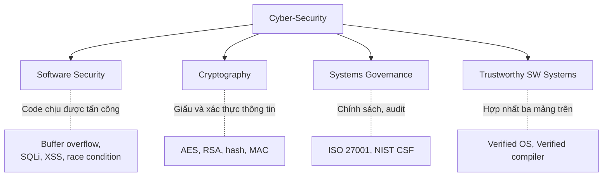

# 1.1 Software Security là gì?

> **Tóm tắt một dòng**: Software Security là ngành kỹ thuật giúp **viết ra phần mềm tiếp tục hoạt động đúng** ngay cả khi có kẻ tấn công cố tình tìm cách phá. Nó khác Cryptography (chuyên về thuật toán mã hoá) và rộng hơn việc đơn thuần "vá lỗ hổng".

## Một câu chuyện mở đầu

Năm 2014, một lỗi rất nhỏ trong OpenSSL, thư viện mã hoá được tích hợp trong gần như mọi trang web HTTPS, đã làm cả thế giới Internet rung chuyển. Lỗi đó tên là **Heartbleed**. Về mặt giải thuật, OpenSSL hoàn toàn đúng: nó cài đặt TLS chính xác theo chuẩn, dùng RSA và AES với key size đủ mạnh, và đã được kiểm chứng cryptography. Nhưng chỉ vì **bốn dòng code** không kiểm tra biên một biến `length` đến từ client, mọi server dùng OpenSSL trở thành mỏ vàng: kẻ tấn công có thể đọc tuỳ ý 64 KB bộ nhớ heap của server, nơi chứa private key, password, session cookie.

Câu chuyện này minh hoạ rất rõ một sự thật khó chịu: **một thuật toán đúng về mặt toán học không bảo vệ được hệ thống nếu code cài đặt nó có bug**. Đây chính là lý do Software Security tồn tại như một ngành học riêng, tách biệt với Cryptography.

## Định nghĩa

Vậy chúng ta sẽ gọi **Software Security** (an toàn phần mềm) là tập hợp **người, quy trình và kỹ thuật** dùng để xây dựng phần mềm sao cho nó bảo đảm được ba thuộc tính cốt lõi gọi là **CIA Triad**:

- **Confidentiality** (bí mật): thông tin chỉ được tiết lộ cho những người có quyền.
- **Integrity** (toàn vẹn): dữ liệu không bị sửa đổi trái phép.
- **Availability** (sẵn sàng): hệ thống trả lời khi được yêu cầu hợp lệ.

Ta sẽ dành cả [bài 1.2](./02-cia-and-properties) để mổ xẻ ba thuộc tính này, vì chúng là **thước đo gốc** của mọi loại lỗ hổng. Trước khi đến đó, hãy hiểu vì sao Software Security cần phân biệt rạch ròi với các ngành lân cận.

## Phân biệt với Cryptography

Cryptography và Software Security thường bị nhầm lẫn vì cùng nói tới "bảo mật", nhưng hai ngành hoạt động ở hai **tầng** rất khác nhau.

Cryptography là toán học của việc giấu và xác thực thông tin. Nó trả lời các câu hỏi như "Làm thế nào để hai bên trao đổi tin nhắn qua kênh không tin cậy mà bên thứ ba nghe lén không hiểu được?" hoặc "Làm thế nào để chứng minh tôi biết một bí mật mà không tiết lộ bí mật đó?". Câu trả lời của Cryptography là các thuật toán: RSA, AES, SHA-256, ZKP. Quan trọng là, Cryptography **giả định rằng người dùng cài đặt thuật toán đúng**.

Software Security đứng ở một tầng thấp hơn, lo về chính cái "cài đặt đúng" đó. Khi bạn viết một hàm RSA trong C, có hàng tá cách bạn có thể vô tình tạo ra lỗ hổng: con trỏ chỉ vào bộ nhớ không khởi tạo, biến đếm tràn dải số, một thread đọc giữa lúc thread khác đang ghi. Heartbleed là minh chứng kinh điển: giải thuật TLS hoàn toàn đúng, nhưng code C để lộ memory vì thiếu một check `length`.

Có một cách diễn đạt rất ngắn gọn về sự khác biệt này: **"Cryptography giả định code đúng. Software Security làm cho code đúng."**

## Năm thuộc tính của hệ thống tin cậy

Khi đi vào thực tế, CIA Triad đôi khi chưa đủ để diễn tả mọi yêu cầu của hệ thống. Một hệ thống có thể bảo mật tốt nhưng vẫn không dùng được vì nó hay hỏng hoặc xử lý sai. Vì thế, cộng đồng *Dependable Systems* mở rộng CIA thành **năm thuộc tính của một hệ thống tin cậy**:

| Thuộc tính | Tiếng Anh | Ý nghĩa | Ví dụ vi phạm |
|---|---|---|---|
| Tin cậy chức năng | Reliability | Cung cấp dịch vụ đúng đặc tả | Phần mềm ngân hàng tính lãi sai |
| Sẵn sàng | Availability | Trả lời khi được gọi | DDoS làm web sập |
| An toàn vật lý | Safety | Không gây hại con người hay môi trường | Hệ thống lái tự động đâm xe |
| Đàn hồi | Resilience | Hồi phục khi gặp sự cố | Hệ thống không restart được sau crash |
| An toàn bảo mật | Security | Không bị tấn công có chủ đích | Bị inject SQL |

Có một điểm rất quan trọng cần làm rõ vì sinh viên hay nhầm: **Safety và Security không phải là cùng một thứ**. Cả hai đều nói về "an toàn", nhưng đối tượng đe doạ khác nhau:

- **Safety** chống lại các **lỗi ngẫu nhiên hoặc môi trường**: tia vũ trụ làm lật bit, phần cứng hỏng, người vận hành bấm nhầm nút.
- **Security** chống lại **kẻ tấn công có chủ đích**: có động cơ rõ ràng, có thời gian nghiên cứu, có công cụ chuyên nghiệp.

Sự phân biệt này quan trọng vì cách phòng tránh khác nhau. Để chống lỗi ngẫu nhiên, ta dùng kỹ thuật như redundancy (ECC RAM), error-correcting code, replication. Để chống kẻ tấn công, ta dùng kỹ thuật như input validation, sandboxing, cryptography. Một bug có thể vi phạm **cả hai cùng lúc**: buffer overflow trong xe tự lái vừa là safety hazard (gây tai nạn ngẫu nhiên do bit lật) vừa là security vulnerability (kẻ tấn công gửi gói tin được chế để gây tai nạn cố ý).

:::tip Phép loại suy
Hãy hình dung Safety và Security qua một toà nhà. Safety lo về việc xây dựng vững chắc, có hệ thống báo cháy, có lối thoát hiểm: chống lại hoả hoạn ngẫu nhiên hay động đất. Security lo về khoá cửa, camera, bảo vệ: chống lại trộm có ý đồ. Một viên gạch lung lay vừa nguy hiểm cho người đi qua (safety) vừa có thể bị kẻ trộm dùng để leo vào (security).
:::

## Vị trí trong bản đồ Cyber-Security

Nếu ta vẽ một bản đồ rộng hơn về An ninh mạng (Cyber-Security), Software Security là một trong bốn nhánh chính:

Mỗi nhánh có "khán giả" riêng. Cryptography là sân chơi của các nhà toán học và nhà nghiên cứu mật mã. Systems Governance dành cho các CISO, auditor, người làm chính sách. Trustworthy Software Systems là biên giới hàn lâm, nơi người ta dùng theorem prover để chứng minh micro-kernel hay compiler. Còn Software Security, sân chơi của những người đọc mã nguồn và viết test, là **phần thực tiễn nhất** và là phần mà mọi developer ít nhiều đều cần biết.

## Quan hệ với các môn lân cận

Trong giáo trình, Software Security thường được dạy sau khi sinh viên đã có kiến thức nền từ sáu môn:

Đầu tiên là **Cyber-Security** ở mức tổng quan, cung cấp khung khái niệm chung: threat actor, attack surface, defense in depth. Software Security sẽ là phần kỹ thuật cụ thể hoá khung này ở tầng mã nguồn.

Tiếp theo là **Cryptography**, vì như đã phân tích ở trên, Software Security cần biết cryptography làm được gì và không làm được gì để không "phát minh lại bánh xe". Hơn nữa, nhiều lỗ hổng nghiêm trọng nhất nằm chính trong code cài đặt cryptography (Heartbleed, ROCA, Logjam).

Sau đó là **Automated Reasoning and Verification**, nguồn cung cấp công cụ SAT, SMT, model checking. Đây là **nền tảng toán học** cho Lecture 3 và Lecture 4. Nếu bạn chưa học môn này, đừng lo: tài liệu sẽ giới thiệu lại các khái niệm cần thiết khi đụng tới.

**Logic and Modelling** dạy các logic thời gian như LTL, CTL, Hoare logic. Chúng ta sẽ gặp LTL ở Lecture 5 khi nói về runtime monitoring.

**Agile và Test-Driven Development** cung cấp methodology kiểm thử mà phía dynamic analysis sẽ tận dụng.

Cuối cùng, **Software Engineering Concepts In Practice** cung cấp các lifecycle như Microsoft SDL hay OWASP SAMM, giúp tích hợp security vào quy trình phát triển. Đây là phần "process" của Software Security, song song với phần "technical" mà chúng ta tập trung trong tài liệu này.

## Mục tiêu kiến thức của tài liệu

Khi hoàn thành tài liệu, bạn sẽ có khả năng:

1. **Giải thích** tại sao "broken software" là nguyên nhân gốc của hầu hết sự cố an ninh mạng, kèm ví dụ cụ thể.
2. **Mô tả** quy trình quản lý rủi ro liên tục (*continuous risk management*) và cách áp dụng vào dự án phần mềm thực tế.
3. **Tích hợp** các thuộc tính security vào *Software Development Lifecycle* (SDLC) thông qua threat modelling và security requirement.
4. **Sử dụng** kỹ thuật V&V (Verification và Validation) để phát hiện vulnerabilities trong code C hoặc Java.
5. **Liên kết** kết quả V&V với phân tích rủi ro để bảo đảm hệ thống vẫn resilient khi bị tấn công.
6. **Đánh giá** trade-off giữa security với performance, usability và cost.

Những mục tiêu này tương ứng từng phần với bốn cụm bài giảng. Cụm 1 lo phần (1), (2), (3). Cụm 2-4 lo phần (4), (5). Phần (6) là chủ đề xuyên suốt được nhắc trong mọi cụm.

## Lộ trình tiếp theo

Bốn cụm bài giảng được sắp xếp theo độ phức tạp tăng dần và phụ thuộc lẫn nhau:

| Cụm | Trọng tâm | Đường dẫn |
|---|---|---|
| Lecture 1-2 | Khái niệm, vulnerabilities, intro formal verification | [Cụm này](./01-overview) |
| Lecture 3 | Static analysis cho chương trình tuần tự (BMC, SAT, SMT) | [Lecture 3](../02-static-analysis-i/01-overview) |
| Lecture 4 | Static analysis cho chương trình đa luồng | [Lecture 4](../03-static-analysis-ii/01-overview) |
| Lecture 5 | Dynamic analysis: testing, monitoring, fuzzing | [Lecture 5](../04-dynamic-analysis/01-overview) |

Nếu bạn muốn nhảy ngay vào kỹ thuật, có thể bắt đầu từ Lecture 3. Nhưng nếu chưa quen với khái niệm "property" hay "soundness", nên đọc trước [bài 1.5 (Giới thiệu Formal Verification)](./05-formal-verification-intro) và [bài 1.6 (BMC và SMT basics)](./06-bmc-and-smt-basics) trong cụm này để nắm vocabulary chung.

## Tài liệu tham khảo

Hai cuốn sách được dùng nhiều nhất trong cộng đồng formal verification:

1. **Clarke, Grumberg, Kroening** (2018): *Model Checking* (2nd ed.), MIT Press. Là sách giáo khoa chuẩn cho model checking, dùng tham khảo cho Lecture 3-4.
2. **Kroening, Strichman**: *Decision Procedures: An Algorithmic Point of View*, Springer. Tập trung vào SMT solver và decision procedure, cực kỳ hữu ích khi đọc Lecture 3 về encoding.

Một tài liệu mở rất hay cho phần fuzzing:

3. **Zeller, Gopinath, Hammoudi và cộng sự**: *The Fuzzing Book*, miễn phí trên web. Dùng tham khảo cho Lecture 5.

## Mini-quiz

Q1. Trong một câu, phân biệt Cryptography và Software Security.

Cryptography là toán học của các thuật toán mã hoá và xác thực, giả định người dùng cài đặt đúng. Software Security lo phần **cài đặt đúng** đó, tức là tìm và loại bỏ bug trong code, kể cả code cài đặt cryptography. Heartbleed là ví dụ kinh điển: TLS đúng về mặt thuật toán nhưng code C có bug nên private key bị rò rỉ.

Q2. Phân biệt Safety và Security trong một câu, kèm ví dụ minh hoạ.

Safety chống **lỗi ngẫu nhiên hoặc lỗi môi trường** (hỏng phần cứng, lỗi vận hành), trong khi Security chống **kẻ tấn công có chủ đích, có động cơ và có công cụ**. Một buffer overflow trong xe tự lái vừa là safety hazard (gây tai nạn do bit lật ngẫu nhiên) vừa là security vulnerability (kẻ tấn công kích hoạt có chủ đích).

Q3. Vì sao Cryptography không đủ để bảo đảm Software Security?

Vì Cryptography hoạt động ở tầng thuật toán, giả định code thực thi nó đúng. Khi code cài đặt có bug ở tầng thấp (ví dụ buffer overflow để lộ memory chứa key, hoặc side-channel timing để lộ key qua thời gian xử lý), thuật toán dù chứng minh được an toàn về mặt toán học vẫn bị bypass. Software Security là lớp bảo vệ tầng thấp hơn, lo phần "code đúng" mà Cryptography giả định.

---

**Tiếp theo**: [1.2 CIA Triad và các thuộc tính security](./02-cia-and-properties)
