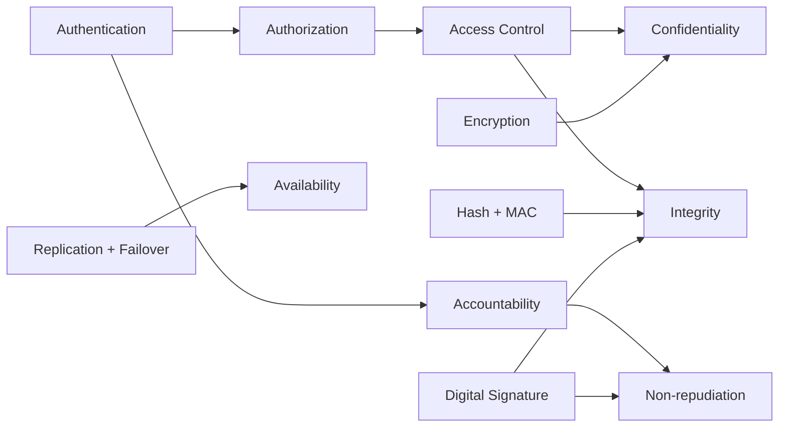

# 1.2 CIA Triad và các thuộc tính security

> **Tóm tắt một dòng**: CIA Triad (Confidentiality, Integrity, Availability) là **thước đo gốc** của An toàn Phần mềm. Mọi lỗ hổng đều có thể quy về vi phạm một trong ba thuộc tính này (hoặc kết hợp). Bốn thuộc tính phái sinh, là Authenticity, Non-repudiation, Accountability và Privacy, giúp diễn đạt yêu cầu cụ thể hơn khi viết security requirement.

## Tại sao chỉ ba thuộc tính?

Khi mới nghe nói "An toàn phần mềm", đa số chúng ta nghĩ ngay tới "chống hacker". Cách hiểu đó không sai, nhưng quá mơ hồ để dùng trong kỹ thuật. Một kỹ sư cần một cái thước rõ ràng để đo: hệ thống an toàn nghĩa là gì? Khi nào ta được phép tuyên bố "OK, hệ thống đã an toàn"?

Cộng đồng nghiên cứu An toàn thông tin từ những năm 1970 đã đi tới một câu trả lời rất thanh lịch: gọn ba từ tiếng Anh bắt đầu bằng C, I, A. Đó là **Confidentiality, Integrity, Availability**, hay CIA Triad. Mọi thuộc tính khác mà bạn nghe nói (authentication, authorization, non-repudiation, privacy) đều có thể diễn giải lại bằng bộ ba này hoặc bằng tổ hợp của chúng. Vì thế CIA Triad không chỉ là "kiến thức nhập môn" mà là **ngôn ngữ chung** để mọi người trong ngành cùng hiểu nhau.

Hãy đi qua từng thuộc tính theo cách của người mới học, từ trực giác trước rồi đến hình thức sau.

## Confidentiality: ai được nhìn thấy gì?

Trực giác của Confidentiality rất gần với khái niệm "bí mật". Khi bạn gửi tin nhắn riêng cho bạn thân, bạn không muốn người ngoài đọc được. Khi ngân hàng lưu số thẻ tín dụng của bạn, ngân hàng không được để nhân viên kế toán xem ngẫu nhiên. Đó là Confidentiality.

Định nghĩa hình thức của nó là: cho tập tài sản $A = \{a_1, \ldots, a_n\}$ (file, record, biến trong bộ nhớ), tập chủ thể $U = \{u_1, \ldots, u_m\}$ (user, process), và một **chính sách** $P: A \times U \to \{\text{allow}, \text{deny}\}$ cho biết ai được đọc gì. Confidentiality phát biểu rằng:

$$\forall a \in A, \forall u \in U: \text{read}(u, a) \implies P(a, u) = \text{allow}$$

Đọc dòng này theo nghĩa thông thường: "với mọi tài sản $a$ và mọi chủ thể $u$, nếu $u$ đọc được $a$, thì chính sách phải cho phép". Nói cách khác, **không có ai đọc được tài sản mà họ không được phép**.

Sinh viên hay nhầm Confidentiality chỉ là "encryption". Encryption là **một** cách để đạt Confidentiality, nhưng không phải cách duy nhất. Có ít nhất ba lớp kỹ thuật cần thiết:

Ở lớp cao nhất là **access control**, tức cơ chế quyết định ai có quyền đọc gì. Các mô hình kinh điển bao gồm RBAC (Role-Based), ABAC (Attribute-Based), MAC (Mandatory). Đây là phần mà sysadmin và developer phải cài đặt đúng. Ví dụ, một bug "Insecure Direct Object Reference" (IDOR) trong web app cho phép user A đổi URL từ `/account/123` thành `/account/124` để xem account của user B là vi phạm Confidentiality ở lớp access control, không liên quan gì tới encryption.

Ở lớp giữa là **encryption tại nghỉ và tại truyền** (encryption at rest và in transit). Đây là nơi cryptography phát huy tác dụng: AES bảo vệ file trên ổ cứng, TLS bảo vệ gói tin trên đường truyền.

Ở lớp thấp nhất, và thường bị quên, là **side-channel resistance**: chương trình không được rò rỉ thông tin qua các kênh phụ như thời gian xử lý, mức tiêu thụ điện, cache miss/hit, hay tiếng động. Một trong những vụ side-channel nổi tiếng là Spectre và Meltdown (2018) khai thác cache hit để đọc memory từ kernel.

## Integrity: dữ liệu có còn nguyên không?

Trực giác của Integrity là "không bị sửa trái phép". Khi bạn gửi một file `.pdf` cho đồng nghiệp, bạn muốn người nhận thấy đúng nội dung bạn gửi, không bị ai đó chèn thêm trang khác. Khi bạn chuyển 1 triệu đồng, bạn muốn số tiền không bị sửa thành 10 triệu giữa đường.

Định nghĩa hình thức:

$$\forall a \in A, \forall u \in U: \text{write}(u, a) \implies P(a, u) = \text{allow}$$

Cùng cấu trúc như Confidentiality nhưng đổi `read` thành `write`. Tuy nhiên, Integrity có một sắc thái mà Confidentiality không có: nó bao gồm cả việc **chống sửa đổi tình cờ** chứ không chỉ chống cố ý. Một bit bị lật do tia vũ trụ trong RAM ECC cũng là vi phạm Integrity, dù không có "kẻ tấn công" nào cả.

Trong thực tế, ta phân biệt hai mức Integrity:

**Data integrity** chỉ nói về nội dung. Hash function như SHA-256, MAC như HMAC, chữ ký số như Ed25519 là các công cụ tiêu chuẩn để bảo đảm data integrity. Khi bạn tải một file từ Internet, hash MD5 (đã yếu) hay SHA-256 đính kèm giúp bạn kiểm tra file không bị sửa.

**System integrity** rộng hơn: nó nói về **hành vi của chương trình** có đúng đặc tả không. Một bug trong chương trình tính lãi ngân hàng làm số tiền sai cũng là vi phạm system integrity, dù không có ai cố tình sửa data. Và đây chính là phần mà BMC và testing đảm bảo: bằng cách kiểm tra mọi execution của chương trình tuân theo đặc tả.

:::tip[Phép loại suy]
Hình dung Confidentiality như niêm phong một bức thư trong phong bì có dấu đỏ: người ngoài không thấy nội dung. Integrity là dấu đỏ đó: nếu ai mở thư, dấu vỡ và người nhận biết. Bạn có thể có Integrity mà không cần Confidentiality (gửi tin nhắn công khai nhưng ký số), hoặc Confidentiality mà không Integrity (mã hoá nhưng không ký). Hai thuộc tính tách biệt và thường cần cả hai cùng lúc.
:::

## Availability: hệ thống có trả lời không?

Trực giác của Availability đơn giản nhất trong ba thuộc tính: "khi cần thì có". Khi bạn vào trang Facebook lúc 8h sáng, bạn muốn trang load lên. Khi bạn rút tiền ATM, bạn muốn máy trả tiền. Một hệ thống "an toàn" mà luôn down hoặc luôn quá tải thì cũng không khác gì không có.

Định nghĩa hình thức:

$$\forall a, u \text{ với } P(a, u) = \text{allow}: \text{request}(u, a) \implies \text{response trong thời gian } T$$

Trong công nghiệp, Availability được đo bằng phần trăm thời gian hệ thống "lên" (uptime). Công thức kinh điển là:

$$\text{Availability} = \frac{MTBF}{MTBF + MTTR}$$

trong đó MTBF (Mean Time Between Failures) là thời gian trung bình giữa hai lần hỏng và MTTR (Mean Time To Repair) là thời gian trung bình để sửa xong. Mục tiêu nổi tiếng "five nines" (99.999%) tương ứng với downtime không quá 5.26 phút trong một năm.

Có một điều thú vị về công thức này: bạn có thể tăng Availability bằng **cả hai** chiến lược. Tăng MTBF nghĩa là làm hệ thống ít hỏng hơn (phần cứng tốt, code chất lượng, testing kỹ). Giảm MTTR nghĩa là khi hỏng thì sửa thật nhanh (auto-failover, hot standby, runbook). Hệ thống cloud hiện đại như AWS hay Google Cloud thiên về chiến lược thứ hai: họ chấp nhận server hỏng thường xuyên nhưng thời gian phục hồi tính bằng giây.

## Bốn thuộc tính phái sinh

CIA Triad là thước đo gốc, nhưng khi viết security requirement chi tiết, ta thường cần bốn khái niệm phái sinh sau.

**Authenticity** (xác thực) trả lời câu hỏi: "Người gửi message này có đúng là người họ tuyên bố không?". Nó khác Integrity ở chỗ: Integrity chỉ nói "nội dung không đổi", còn Authenticity yêu cầu **danh tính người tạo cũng đúng**. Bạn có thể có Integrity mà không có Authenticity: một tài liệu không bị sửa nhưng không chắc do ai viết. Cơ chế đạt Authenticity là chữ ký số (asymmetric) hoặc MAC với pre-shared key (symmetric).

**Non-repudiation** (chống chối bỏ) trả lời câu hỏi: "Người gửi có thể chối là họ đã gửi không?". Đây là thuộc tính cực kỳ quan trọng trong giao dịch tài chính và hợp đồng điện tử. Có một điểm tinh tế đáng nhớ: **MAC không cho Non-repudiation**, chỉ chữ ký số mới cho. Lý do: MAC dùng key đối xứng chia sẻ giữa A và B, nên cả A và B đều có thể tạo MAC hợp lệ. Khi tranh chấp, A có thể chối "không phải tôi gửi, B tự bịa MAC đó". Còn chữ ký số dùng private key chỉ A có, nên A không thể chối.

**Accountability** (truy vết) trả lời: "Khi có sự cố, ta truy ngược về ai chịu trách nhiệm được không?". Cơ chế đạt được là audit log đầy đủ kết hợp authentication mạnh. Có một sai lầm rất phổ biến phá vỡ Accountability mà tôi muốn lưu ý: dùng chung một tài khoản admin cho nhiều người. Khi nhiều DevOps cùng login bằng `root`, log chỉ ghi "root đã xoá database lúc 3h sáng" mà không biết là người nào trong số họ. Accountability sụp đổ.

**Privacy** (riêng tư) trả lời: "Dữ liệu cá nhân có được dùng đúng mục đích đã thông báo không?". Đây là khái niệm **rộng hơn Confidentiality**. Privacy không chỉ hỏi "ai đọc được" mà còn hỏi "đọc để làm gì, có consent không, có lưu lâu hơn cần thiết không". Các khung pháp lý như GDPR (châu Âu), CCPA (California), Nghị định 13/2023 (Việt Nam) là quy định cụ thể cho Privacy.

## Mối quan hệ giữa các thuộc tính

Khi đã hiểu từng thuộc tính, hãy nhìn vào bức tranh tổng để thấy chúng nối với nhau thế nào:



Hãy đọc sơ đồ này theo dòng chảy. **Authentication** (xác minh danh tính: bạn là ai?) là gốc. Không có authentication thì không có Authorization (bạn được làm gì?), từ đó không có Access Control (cài đặt cụ thể của authorization). Confidentiality và Integrity đều phụ thuộc Access Control: chỉ khi hệ thống biết bạn là ai và bạn được làm gì, nó mới quyết định có cho bạn đọc/ghi không.

Accountability cũng cần Authentication làm gốc: log "user X đã làm Y" chỉ có giá trị khi X được xác thực đúng. Non-repudiation thì tiếp tục mở rộng Accountability bằng chữ ký số.

Availability nằm hơi tách biệt ở bên phải vì nó là vấn đề kiến trúc (replication, load balancing, failover) chứ không phải vấn đề cryptography. Một hệ thống có cryptography hoàn hảo nhưng chỉ có 1 server vẫn dễ down vì DDoS.

## Trường hợp nghiên cứu: Heartbleed dưới lăng kính CIA

Hãy đem khung CIA vừa học áp dụng vào một sự kiện thực: **Heartbleed (CVE-2014-0160)**, lỗ hổng OpenSSL đã nhắc ở bài 1.1.

Đoạn code rút gọn của bug:

```c
int dtls1_process_heartbeat(SSL *s) {
    unsigned char *p = &s->s3->rrec.data[0];
    unsigned short hbtype = *p++;
    unsigned int payload;
    n2s(p, payload);
    unsigned char *pl = p;

    if (hbtype == TLS1_HB_REQUEST) {
        unsigned char *buffer = OPENSSL_malloc(1 + 2 + payload + padding);
        unsigned char *bp = buffer;
        *bp++ = TLS1_HB_RESPONSE;
        s2n(payload, bp);
        memcpy(bp, pl, payload);
    }
}
```

Hãy đi qua từng dòng để hiểu bug nằm ở đâu.

Hàm này xử lý "heartbeat" của TLS, một cơ chế cho phép client gửi một message ngắn để giữ kết nối, server echo lại. Dòng `n2s(p, payload)` đọc 2 byte từ client làm độ dài của payload. Biến `payload` có kiểu `unsigned int`, có thể nhận giá trị tới 65535. Dòng `memcpy(bp, pl, payload)` sau đó copy `payload` byte từ con trỏ `pl` (cuối heartbeat record) vào buffer mà server sẽ gửi trả về client.

**Bug**: code không kiểm tra `payload` có nhỏ hơn hoặc bằng **kích thước thực** của heartbeat record nhận từ client. Nếu client gửi một heartbeat dài 3 byte nhưng khai báo `payload = 65535`, `memcpy` sẽ copy 65535 byte tiếp theo trong heap. Heap đó chứa private key, password, session cookie, mọi thứ. Tất cả bị gửi trả về cho client.

Bây giờ áp khung CIA:

| Thuộc tính | Có bị vi phạm? | Lý do |
|---|---|---|
| Confidentiality | Có (rất nặng) | Private key, password lộ qua memory dump |
| Integrity | Không trực tiếp | Attacker chỉ đọc, không sửa heap |
| Availability | Không | Server vẫn chạy bình thường |

Điểm thú vị là Integrity **không bị vi phạm trực tiếp**, nhưng bị ảnh hưởng gián tiếp. Khi attacker đã có private key, họ có thể giả mạo server, ký giả message thay server, hoặc giải mã traffic đã ghi lại trước đó. Đây là lý do sau Heartbleed, mọi service phải **rotate key** chứ không chỉ vá code.

Bài học rút ra cho chúng ta là gì? Có ba điểm:

Thứ nhất, **bug rất nhỏ về dòng code** ($\approx 4$ dòng) có thể phá CIA ở mức cực nghiêm trọng. Việc đếm số dòng code có lỗi không phản ánh tác động.

Thứ hai, **giải thuật TLS hoàn toàn đúng**. Vấn đề ở bounds checking trong implementation. Đây chính là ranh giới giữa Cryptography và Software Security.

Thứ ba, một công cụ BMC như CBMC hoặc ESBMC **có thể phát hiện** lỗi này nếu được dạy một property tổng quát kiểu "mọi `memcpy` với length đến từ untrusted input phải thoả $\text{length} \leq \text{available bytes}$". Chương trình tự động làm việc này đáng nhẽ là không khó về mặt kỹ thuật, nhưng OpenSSL khi đó chưa được verify như vậy. Sau Heartbleed, dự án Boring (Google) và LibreSSL (OpenBSD) đã chú trọng hơn vào verification.

## Cách viết security requirement tốt

Để khép lại bài, tôi muốn giới thiệu một mẫu rất hữu ích khi viết yêu cầu security trong tài liệu thiết kế: **STAR** (Subject, Target, Action, Restriction). Thay vì viết một yêu cầu mơ hồ kiểu "the system must be secure", hãy viết:

> *"User A (Subject) chỉ được phép đọc (Action) record của chính mình (Target) trong giờ hành chính và từ IP công ty (Restriction)."*

Có hai lợi ích cụ thể. Thứ nhất, yêu cầu kiểu STAR có thể **dịch thẳng** thành property cho BMC verify, hoặc thành test case cho fuzzer. Thứ hai, khi nhiều thành viên trong team đọc cùng một yêu cầu, họ không hiểu khác nhau, vì mọi từ đều ánh xạ về một thực thể cụ thể.

## Mini-quiz

<details>
<summary>Q1. Vì sao chữ ký số bảo đảm Non-repudiation nhưng MAC thì không?</summary>

MAC dùng key đối xứng chia sẻ giữa hai bên A và B. Vì cả A và B đều biết key, cả hai đều có thể tạo MAC hợp lệ. Khi tranh chấp, A có thể chối "không phải tôi gửi, B tự tạo MAC đó". Còn chữ ký số dùng private key chỉ A nắm giữ, nên không ai khác tạo được chữ ký A. Nếu chữ ký verify thành công, chứng tỏ A đã ký, và A không thể chối.
</details>

<details>
<summary>Q2. Heartbleed vi phạm thuộc tính CIA nào và vì sao Integrity không bị vi phạm trực tiếp?</summary>

Heartbleed vi phạm Confidentiality ở mức nặng (rò rỉ private key, password, session cookie). Integrity không bị vi phạm trực tiếp vì attacker chỉ đọc heap, không sửa. Tuy nhiên Integrity về lâu dài bị ảnh hưởng vì attacker có thể dùng private key đã lộ để giả mạo server hoặc giải mã traffic cũ. Availability cũng không bị ảnh hưởng vì server vẫn chạy bình thường, attack thậm chí rất khó phát hiện trong log.
</details>

<details>
<summary>Q3. Tính Availability cho hệ thống có MTBF = 720 giờ và MTTR = 1 giờ.</summary>

Áp dụng công thức:
$$\text{Availability} = \frac{720}{720 + 1} = \frac{720}{721} \approx 0.99861$$

Tức 99.861%, tương đương downtime khoảng 12.2 giờ mỗi năm. Để đạt "three nines" (99.9%), cần $\frac{MTBF}{MTBF + MTTR} \geq 0.999$, suy ra $MTTR \leq MTBF \cdot \frac{0.001}{0.999} \approx 0.001 \cdot MTBF$. Với MTBF = 720, MTTR phải $\leq 0.72$ giờ, tức 43 phút.
</details>

---

**Tiếp theo**: [1.3 Catalog các lớp lỗ hổng phổ biến](./03-vulnerabilities-catalog)
