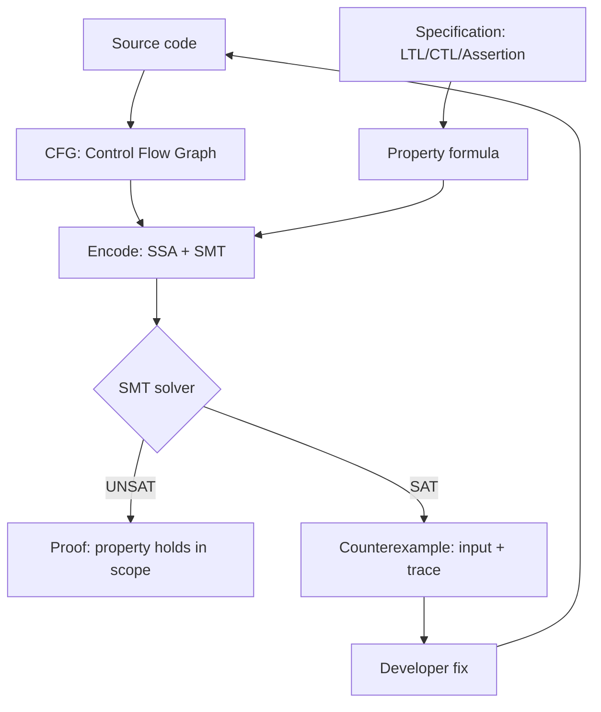

# 1.5 Giới thiệu Formal Verification

> **Tóm tắt một dòng**: Formal verification dùng toán học để **chứng minh** một chương trình thoả một property, thay vì chỉ test một vài trường hợp. Ba họ kỹ thuật chính là model checking (tự động, scale tới chương trình lớn), theorem proving (tổng quát nhất nhưng cần human), và abstract interpretation (compromise giữa hai bên).

## Vì sao testing không đủ?

Hãy bắt đầu với một câu nói rất nổi tiếng của Edsger Dijkstra từ năm 1972:

> *"Program testing can be used to show the presence of bugs, but never to show their absence."*

Câu này nghe có vẻ triết học, nhưng thực ra rất cụ thể. Hãy thử cảm nhận quy mô vấn đề bằng một bài toán đơn giản.

Giả sử bạn viết một hàm rất ngắn: nhận hai số nguyên 32-bit, trả về tổng. Để **test exhaustively**, tức kiểm tra mọi cặp input có thể, bạn cần $2^{32} \times 2^{32} = 2^{64} \approx 1.8 \times 10^{19}$ test case. Giả sử mỗi test mất 1 nano giây (rất nhanh), tổng thời gian là $1.8 \times 10^{10}$ giây, tức khoảng **585 năm**.

Mà đó mới chỉ là một hàm cộng. Một hàm xử lý chuỗi 100 ký tự có $256^{100}$ input khả dĩ, một con số nhiều hơn số nguyên tử trong vũ trụ quan sát được. Không có cách nào test hết.

Vì thế testing trong thực tế chỉ kiểm tra một **mẫu** rất nhỏ của input space. Khi test pass, ta không kết luận được "không có bug", chỉ kết luận "chưa tìm thấy bug với mẫu này". Đây là khoảng cách giữa "testing" và "verification":

- **Testing trả lời**: "Có lỗi" (khi tìm thấy counterexample) hoặc "Chưa tìm thấy lỗi" (không khẳng định gì về tính đúng đắn).
- **Verification trả lời**: "Có lỗi" (kèm counterexample cụ thể) hoặc "**Không có lỗi**" (kèm một bằng chứng toán học, đảm bảo cho toàn bộ input space hoặc một bound nào đó).

Vế thứ hai mới là điểm mạnh của verification: tuyên bố mạnh mẽ "không có lỗi" mà testing không bao giờ làm được.

## Property là gì?

Trước khi nói về verification, ta cần định nghĩa cái mà ta verify. Cái đó gọi là **property** (tính chất). Property là một **mệnh đề** mà mọi execution của chương trình phải thoả. Có hai loại property cần phân biệt rõ ràng.

### Safety property

**Safety property** phát biểu rằng "một điều xấu không bao giờ xảy ra". Ví dụ:

- "Không bao giờ chia cho 0."
- "Mọi `malloc` đều có `free` tương ứng."
- "Mọi mảng access đều trong bounds."
- "Không bao giờ đọc memory chưa khởi tạo."
- "Không có hai user khác nhau cùng đăng nhập bằng một session."

Đặc điểm cốt lõi: nếu safety property bị vi phạm, ta có thể chỉ ra **một trace hữu hạn** (một chuỗi instruction cụ thể) dẫn tới sự vi phạm. Vì thế counterexample của safety luôn hữu hạn, dễ tái tạo và dễ debug.

Trong ngôn ngữ logic thời gian LTL (Linear Temporal Logic), safety viết là $G \neg \phi$, đọc là "globally not $\phi$", với $\phi$ là điều xấu cần tránh. Bạn sẽ gặp LTL chi tiết ở Lecture 5.

### Liveness property

**Liveness property** phát biểu rằng "một điều tốt cuối cùng sẽ xảy ra". Ví dụ:

- "Mọi request cuối cùng đều có response."
- "Mọi thread đang chờ lock cuối cùng đều nhận được."
- "Server không bị deadlock vĩnh viễn."
- "Mọi gói tin gửi đi cuối cùng đều được ACK hoặc timeout."

Đặc điểm cốt lõi: nếu liveness bị vi phạm, ta cần chỉ ra **một trace vô hạn** mà điều tốt không bao giờ xảy ra. Counterexample của liveness vô hạn, khó tái tạo trong testing.

Trong LTL, liveness viết là $F \phi$, "finally $\phi$", "rồi $\phi$ sẽ đúng".

:::tip[Mẹo phân biệt]
Một cách dễ nhớ. Hỏi: "Tôi cần xem trace bao lâu để phát hiện vi phạm?"

- Nếu trace **hữu hạn** đã đủ, đó là **safety**. Ví dụ: ngay khi gặp một `div(x, 0)`, ta biết property "không chia cho 0" bị vi phạm.
- Nếu cần trace **vô hạn**, đó là **liveness**. Ví dụ: để chứng minh "không bao giờ trả lời", ta phải xem chương trình mãi mãi.

Lecture 3 và 4 tập trung safety vì BMC chỉ unfold hữu hạn bước, phù hợp với safety. Lecture 5 với LTL và Büchi automata mới đụng được liveness.
:::

## Soundness và Completeness: hai thuộc tính quan trọng nhất của verifier

Khi đánh giá một tool verification, ta luôn hỏi hai câu:

1. Khi tool nói "an toàn", có thể tin được không?
2. Khi chương trình thực sự an toàn, tool có nói được không?

Hai câu hỏi này tương ứng với hai khái niệm cốt lõi.

**Soundness** (đáng tin): nếu verifier nói "an toàn", thì chương trình **thực sự** an toàn. Tool sound không bao giờ miss bug. Hậu quả nếu thiếu soundness: **false negative**, tức bỏ sót bug thật, tin tưởng sai vào chương trình.

**Completeness** (đầy đủ): nếu chương trình thực sự an toàn, verifier sẽ nói được "an toàn" trong thời gian hữu hạn. Tool complete không bao giờ báo nhầm. Hậu quả nếu thiếu completeness: **false positive**, tức báo có bug nhưng thực ra không có, làm developer mất công xem.

Lý tưởng nhất là một tool vừa sound vừa complete vừa terminate (kết thúc trong thời gian hữu hạn). Nhưng có một định lý toán học chặn ước mơ này.

### Định lý Rice

Định lý Rice (1953) phát biểu rằng: **mọi property non-trivial về behavior của chương trình Turing-complete đều không thể quyết định được** (undecidable). "Non-trivial" nghĩa là property không phải hằng true hay hằng false.

Hệ quả thực tế: không có verifier nào có thể vừa sound, vừa complete, vừa terminate, vừa áp dụng cho mọi chương trình. Mọi tool phải **đánh đổi** ít nhất một trong bốn:

- Hy sinh terminate: tool có thể chạy mãi không xong (ví dụ symbolic execution với path explosion).
- Hy sinh soundness: tool có thể miss bug (linter, một số tool như Infer của Facebook).
- Hy sinh completeness: tool có thể báo false positive (abstract interpretation).
- Hy sinh phạm vi: tool chỉ chạy cho một class chương trình cụ thể (BMC chỉ scope tới depth $k$, không cho mọi loop).

Bảng dưới đây cho thấy các tool phổ biến đánh đổi như thế nào:

| Tool | Sound? | Complete? | Cách đánh đổi |
|---|:-:|:-:|---|
| Testing thông thường | Không | Không | Test cụ thể, có thể miss và có thể không terminate (loop bug) |
| BMC (CBMC, ESBMC) | Sound trong bound $k$ | Complete trong bound $k$ | Giới hạn loop depth, miss bug cần loop > $k$ |
| Abstract Interpretation (Astrée) | Sound | Không complete | Báo false positive nhưng không miss bug |
| Theorem Prover (Coq, Isabelle) | Sound | Không complete | Cần human guidance, không chạy tự động |
| Symbolic Execution (KLEE) | Sound nếu khám phá hết | Không (path explosion) | Cắt path bằng heuristic |
| Linter (Coverity, Infer) | Không | Không | Heuristic, nhanh, nhưng có thể miss và có thể nhầm |

:::warning[Khi nào cần sound, khi nào không?]
Trong **safety-critical** (avionics, medical, automotive, nuclear), bắt buộc tool phải **sound**. Một tool unsound nói "OK" rồi máy bay rơi là không chấp nhận được. Ngành avionics dùng Astrée để verify code của Airbus A380, mức độ tin cậy cực cao.

Trong **web/app thông thường**, có thể chấp nhận tool unsound (như Coverity, Infer của Facebook) miễn là tỷ lệ false positive thấp và bắt được phần lớn bug. Đánh đổi là về scale: tool sound chạy chậm, unsound chạy nhanh và scale tới triệu dòng code.
:::

## Ba họ kỹ thuật chính

Formal verification chia thành ba họ kỹ thuật lớn, mỗi họ có thế mạnh riêng.

### Model Checking

Ý tưởng: mô tả chương trình bằng một **finite-state transition system** $M = (S, S_0, R)$, trong đó:

- $S$ là tập tất cả state mà chương trình có thể ở.
- $S_0 \subseteq S$ là tập state khởi tạo.
- $R \subseteq S \times S$ là transition relation, cho biết từ state $s$ có thể đi tới state $s'$ qua một bước.

Sau đó, cho property $\phi$ (viết bằng LTL hoặc CTL), ta hỏi:

$$M \models \phi \quad ?$$

Đọc là "$M$ thoả $\phi$ không?". Model checker khám phá không gian state để trả lời.

Có hai cách hiện thực model checking:

**Explicit-state model checking** liệt kê hết các state, lưu trong hash table, kiểm tra từng cái. Phù hợp với chương trình nhỏ. Tool: SPIN, NuSMV.

**Symbolic model checking** biểu diễn cả tập state bằng một công thức (BDD hoặc SMT formula), không liệt kê từng cái. Scale tới chương trình lớn hơn nhiều. **Bounded Model Checking (BMC)** mà chúng ta sẽ học chi tiết là một biến thể symbolic, giới hạn depth $k$ để tránh state explosion. Chi tiết ở [bài 1.6](./06-bmc-and-smt-basics) và [Lecture 3](../02-static-analysis-i/01-overview).

Thế mạnh của model checking: **tự động hoàn toàn**, không cần human input. Bạn đưa code và property vào, tool chạy và cho ra kết quả. Phù hợp cho developer không phải expert toán.

Nhược điểm: bị giới hạn bởi **state explosion**. Chương trình có nhiều biến, vòng lặp sâu, hoặc nhiều thread sẽ làm tool chậm hoặc hết RAM. Lecture 4 sẽ cho thấy các kỹ thuật mở rộng để xử lý concurrency.

### Theorem Proving

Ý tưởng khác hẳn: thay vì cho tool tự khám phá, ta **viết proof** bằng tay (hay đúng hơn, viết proof script) trong một logic bậc cao (Higher-Order Logic hoặc dependent type theory) và đưa cho prover kiểm tra.

Tool: Coq, Isabelle, Lean, Agda, F\*.

Ví dụ kinh điển: dự án **seL4** chứng minh một micro-kernel viết bằng C (10K dòng) thoả các thuộc tính an toàn (functional correctness, integrity, confidentiality) bằng Isabelle. Proof gồm 200K dòng, dự án mất 25 person-years. Kết quả: seL4 là kernel duy nhất trên thế giới được chứng minh hoàn toàn đúng, và đang được dùng trong drone quân sự, thiết bị y tế.

Thế mạnh: chứng minh được **mọi property**, kể cả với chương trình vô hạn state, kể cả liveness, kể cả concurrent. Không bị giới hạn bởi định lý Rice vì human đóng vai trò "oracle" cho phần undecidable.

Nhược điểm: cần **expert toán cao cấp** và **rất nhiều thời gian**. Tỷ lệ "dòng proof per dòng code" thường là 20:1 hoặc cao hơn. Không phù hợp cho code thay đổi nhanh.

### Abstract Interpretation

Đây là compromise thanh lịch giữa model checking và theorem proving. Ý tưởng: thay vì tính chính xác giá trị của mọi biến, ta tính một **over-approximation** trên một abstract domain.

Ví dụ cụ thể nhất là **interval abstract domain**. Thay vì track `x = 5`, ta track `x ∈ [3, 10]`. Khi gặp phép `x + 1`, ta tính trên interval: `[3+1, 10+1] = [4, 11]`. Khi gặp phép `if (x > 0)`, ta refine interval theo điều kiện: `x ∈ [max(0+1, 3), 10] = [3, 10]` trong nhánh true.

Cuối cùng, để check property "x ≠ 0", ta xem interval cuối có chứa 0 không. Nếu không, property chứng minh được. Nếu có, **có thể** vi phạm (false positive nếu thực ra không bao giờ vi phạm).

Có nhiều abstract domain phong phú hơn interval: polyhedra (tập điểm thoả các bất phương trình tuyến tính), octagon (tổng/hiệu hai biến nằm trong khoảng), congruence (modulo). Mỗi domain mạnh hơn nhưng đắt hơn.

Tool: Astrée (verify Airbus A380), Infer (Facebook, scale tới Instagram), Frama-C value analysis.

Thế mạnh: **sound** (không miss bug) và **scale tới chương trình lớn**. Astrée verify hàng triệu dòng C trong vài giờ.

Nhược điểm: **không complete**, sinh ra false positive. Developer phải xem từng warning và xác định đúng/sai.

## Quy trình formal verification điển hình

Khi áp dụng vào project thực, một flow typical bao gồm các bước sau:

Có bốn loại output có thể xảy ra:

- **UNSAT**: property thoả trong scope đã verify. Bạn có thể an tâm trong scope đó.
- **SAT + counterexample**: tool tìm được input cụ thể tái tạo bug. Developer copy input vào unit test rồi fix.
- **Timeout**: solver không quyết định kịp trong thời gian cho phép. Tăng resource hoặc giảm depth.
- **Unknown**: solver không xử lý được fragment logic (ví dụ quantifier không decidable). Có thể chia nhỏ property hoặc đổi tool.

## Khi nào nên dùng formal verification?

Không phải project nào cũng cần verification. Đánh giá theo ma trận risk-vs-cost:

| Tình huống | Có nên dùng? | Tool gợi ý |
|---|:-:|---|
| Driver kernel, firmware | Có (risk cao, code nhỏ) | CBMC, ESBMC, SVF |
| Compiler, hypervisor | Có (cực kỳ critical) | Coq (CompCert), Isabelle (seL4) |
| Smart contract | Có (code immutable, audit đắt) | Certora, KEVM |
| Cryptographic library | Có (consequence catastrophic) | F*, Cryptol |
| ML model robustness | Mới (nghiên cứu sôi nổi) | Marabou, ERAN |
| Web backend CRUD | Thường không | Testing và linting đủ |
| Frontend React app | Không | Type checker và testing |
| Game engine | Không (perf quan trọng hơn) | Profiling và testing |

Một quy tắc đơn giản: **chi phí của một bug có thực sự lớn hơn chi phí của verification không?** Một bug trong kernel kéo theo crash mọi user. Một bug trong smart contract có thể mất hàng triệu USD vĩnh viễn. Đó là những trường hợp verification trả công.

## Mini-quiz

Q1. Sound và Complete khác nhau thế nào? Cho ví dụ tool thiếu mỗi tính chất.

**Sound** nghĩa là "khi tool nói OK thì thực sự OK". Tool sound không miss bug. Ví dụ tool unsound: linter dùng heuristic, có thể bỏ qua một số bug để chạy nhanh.

**Complete** nghĩa là "khi thực sự OK thì tool sẽ nói OK trong thời gian hữu hạn". Tool complete không báo false positive. Ví dụ tool incomplete: abstract interpretation, có thể báo cảnh báo dù thực ra không có bug, vì over-approximation mất chính xác.

Vì định lý Rice, không có tool nào vừa sound vừa complete vừa terminate cho mọi chương trình Turing-complete. Mọi tool đều đánh đổi.

Q2. Phân biệt safety và liveness property. Bug "deadlock" thuộc loại nào?

**Safety**: "điều xấu không xảy ra", counterexample là trace **hữu hạn**.
**Liveness**: "điều tốt sẽ xảy ra", counterexample là trace **vô hạn**.

**Deadlock là liveness violation**: progress không bao giờ đạt được. Khi chương trình đứng vĩnh viễn không trả lời, không có "instruction xấu" cụ thể nào để chỉ ra, chỉ có "không có instruction nào nữa". Khó verify hơn safety nhiều.

Tuy nhiên, ta thường **quy deadlock về safety** bằng cách check một điều kiện hữu hạn: "không state nào không có outgoing transition khả thi". Cách này an toàn nhưng không bắt được mọi loại liveness violation (ví dụ livelock, starvation).

Q3. BMC chứng minh được property cho mọi loop depth không? Nếu không, làm thế nào để bù?

Không. BMC unfold loop tới một depth $k$ cố định mà người dùng chỉ định. Nếu bug cần loop iteration thứ $k+1$ mới lộ, BMC miss.

Có ba cách bù:

1. **Tăng $k$**: đơn giản nhất nhưng chi phí mũ. Phù hợp cho loop có bound thật sự nhỏ.

2. **k-induction**: chứng minh "nếu property đúng tại depth $k$ thì cũng đúng tại $k+1$". Nếu chứng minh được, ta có proof cho mọi $k$, không bị giới hạn. Cài đặt trong CBMC, ESBMC.

3. **Loop invariant**: human cung cấp invariant cho loop, tool verify invariant maintain qua mỗi iteration. Mạnh hơn nhưng cần human work.

Trong [Lecture 3-4](../02-static-analysis-i/01-overview), ta sẽ học cả ba cách này chi tiết.

---

**Tiếp theo**: [1.6 BMC và SMT basics](./06-bmc-and-smt-basics)
