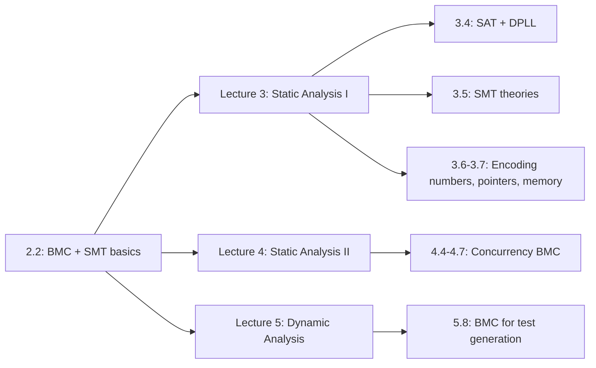

# 2.2 Bounded Model Checking và SMT basics

> **Tóm tắt một dòng**: BMC dịch chương trình + assertion thành công thức logic $\Phi_k$ sao cho $\Phi_k$ SAT khi và chỉ khi có execution dài $\le k$ bước vi phạm assertion. SMT solver (như Z3) quyết định SAT/UNSAT. Đây là nền tảng cho mọi nội dung Lecture 3 và 4.

## Trực giác trước khi vào kỹ thuật

Hãy hình dung BMC như sau. Bạn có một chương trình, và một assertion (kiểu `assert(x != 0)`). Bạn muốn biết: tồn tại input nào khiến chương trình chạy đến assertion mà $x = 0$ không?

Cách "ngây thơ" là chạy chương trình với mọi input có thể, xem có input nào vi phạm không. Đã thấy ở bài 2.1, cách này bất khả thi vì input space khổng lồ.

BMC làm khác. Nó "tháo gỡ" chương trình ra, viết lại tất cả tính toán dưới dạng các **phương trình toán học** trên biến logic. Cụ thể, mỗi instruction "x = y + 1" trở thành một equation "$x_\text{new} = y_\text{old} + 1$". Mỗi điều kiện `if (c)` trở thành "trong nhánh true, c đúng; trong nhánh false, c sai". Cuối cùng, assertion bị **phủ định** và thêm vào hệ phương trình.

Hệ phương trình này, gọi là $\Phi_k$, có một tính chất rất đẹp: nó có nghiệm khi và chỉ khi tồn tại một execution của chương trình dài tối đa $k$ bước vi phạm assertion. Ta đưa hệ này cho SMT solver. Solver trả lời "có nghiệm" (kèm gán giá trị cụ thể là counterexample) hoặc "không có nghiệm" (chứng minh không có vi phạm trong $k$ bước).

So sánh với cách ngây thơ: thay vì duyệt $2^{64}$ input, BMC giao cho SMT solver tìm input vi phạm. Solver dùng các kỹ thuật như DPLL và conflict-driven learning để cắt mạnh không gian tìm kiếm, thường nhanh hơn brute force nhiều bậc.

## Công thức tổng quát của BMC

Cho chương trình $P$, assertion $A$, và bound $k$:

$$\Phi_k = I_0 \land \bigwedge_{i=0}^{k-1} T_i \land \neg A_k$$

Đọc từng phần:

- $I_0$ là ràng buộc state khởi tạo. Ví dụ "biến `x` bắt đầu bằng 0".
- $T_i$ là transition relation từ state $i$ sang state $i+1$. Mỗi $T_i$ encode một instruction.
- $\neg A_k$ là assertion bị vi phạm tại state cuối.

Logic của công thức: ta nói "đúng, chương trình bắt đầu state 0 đúng quy tắc, đi $k$ bước theo đúng transition, và tới state $k$ thì assertion **sai**". Nếu có execution như vậy, đó là counterexample.

Đưa $\Phi_k$ cho SMT solver:

| Kết quả từ solver | Nghĩa thực tế |
|---|---|
| **SAT** + model $M$ | $M$ là gán giá trị cụ thể cho mọi biến, tái tạo input dẫn tới vi phạm assertion. Counterexample tìm được. |
| **UNSAT** | Không tồn tại execution dài $\le k$ vi phạm assertion. Chương trình an toàn trong bound $k$. |
| **TIMEOUT** | Solver không quyết định kịp. Tăng resource hoặc giảm bound. |

Ba ý còn lại của bài này sẽ trả lời ba câu hỏi cụ thể: làm sao encode instruction thành công thức? Làm sao xử lý branch và loop? Và SMT solver có nội dung gì?

## Static Single Assignment (SSA)

Trước khi encode, ta phải chuyển chương trình sang một dạng chuẩn gọi là **SSA form**. Trong SSA, mỗi biến chỉ được **gán đúng một lần**. Các phiên bản khác nhau của cùng biến được phân biệt bằng subscript: $x_1, x_2, x_3, \ldots$.

Tại sao cần SSA? Vì trong logic, "biến" có nghĩa giống "ẩn số" trong đại số. Một ẩn số $x$ chỉ có **một** giá trị. Nếu chương trình ghi "$x$ = 5; $x$ = $x$ + 1", ta không thể dịch thẳng sang công thức "$x = 5 \land x = x + 1$" vì hai phương trình mâu thuẫn (đẳng thức không có nghiệm). SSA tách thành hai biến logic: $x_1 = 5$, $x_2 = x_1 + 1$, không mâu thuẫn nữa.

### Ví dụ chuyển sang SSA

Chương trình gốc:

```c
int x = 5;
x = x + 1;
x = x * 2;
assert(x == 12);
```

Sau khi chuyển SSA:

```
x₁ = 5
x₂ = x₁ + 1
x₃ = x₂ * 2
assert(x₃ == 12)
```

Encode thành SMT-LIB:

```scheme
(declare-const x1 Int)
(declare-const x2 Int)
(declare-const x3 Int)

(assert (= x1 5))
(assert (= x2 (+ x1 1)))
(assert (= x3 (* x2 2)))

; Phủ định assertion để bắt counterexample
(assert (not (= x3 12)))

(check-sat)
```

Solver chạy và trả lời `unsat`. Lý do: từ các ràng buộc, ta suy ra $x_3 = (5+1) \times 2 = 12$. Không thể có $x_3 \neq 12$. Chương trình đúng.

Nếu ta đổi assertion thành `assert(x == 13)`, công thức cuối thành `(not (= x3 13))`. Solver trả `sat` với model $x_3 = 12$, chứng tỏ assertion sai.

## Xử lý branch (if-then-else)

Vấn đề: trong if-else, biến có thể được gán giá trị khác nhau tuỳ nhánh. Làm sao biểu diễn?

Cách giải quyết là dùng phép **if-then-else** của SMT-LIB (gọi tắt là `ite`).

### Ví dụ minh hoạ

```c
int x = nondet_int();
int y;
if (x > 0) y = x + 1;
else       y = x - 1;
assert(y != 0);
```

Hàm `nondet_int()` là cách BMC tool báo "biến này có thể nhận bất kỳ giá trị `int` nào". Ta muốn check assertion `y != 0` đúng với **mọi** giá trị $x$.

SSA:

```
x₁ = nondet
y₁ = ite(x₁ > 0, x₁ + 1, x₁ - 1)
assert(y₁ ≠ 0)
```

SMT-LIB:

```scheme
(declare-const x1 Int)
(declare-const y1 Int)

(assert (= y1 (ite (> x1 0) (+ x1 1) (- x1 1))))
(assert (= y1 0))   ; phủ định "y1 != 0"

(check-sat)
(get-model)
```

Solver chạy. Có $x_1$ nào làm $y_1 = 0$ không?

- Nếu $x_1 > 0$, $y_1 = x_1 + 1 \geq 2 > 0$, không thể bằng 0.
- Nếu $x_1 \leq 0$, $y_1 = x_1 - 1 \leq -1 < 0$, cũng không bằng 0.

Vậy không có $x_1$ nào thoả $y_1 = 0$. Solver trả `unsat`. Assertion đúng cho mọi input.

### Một ví dụ tinh tế: int vs bitvector

Hãy thử một ví dụ "có vẻ rõ ràng":

```c
int x = nondet_int();
int y = x * x;
assert(y >= 0);
```

Trực giác: bình phương của số nguyên không âm. Đúng không? Hãy thử encode hai cách.

**Cách 1: dùng theory Int (số nguyên toán học)**

```scheme
(set-logic QF_LIA)
(declare-const x Int)
(declare-const y Int)
(assert (= y (* x x)))
(assert (< y 0))
(check-sat)
```

Solver trả `unsat`. Trong toán học, $x \cdot x \geq 0$ luôn đúng.

**Cách 2: dùng theory BitVec (32-bit như C thực tế)**

```scheme
(set-logic QF_BV)
(declare-const x (_ BitVec 32))
(declare-const y (_ BitVec 32))
(assert (= y (bvmul x x)))
(assert (bvslt y #x00000000))
(check-sat)
(get-model)
```

Solver trả `sat`! Vì sao? Vì $x = 46341$ cho $x^2 = 2{,}147{,}488{,}281$. Số này vượt $\text{INT\_MAX} = 2^{31} - 1 = 2{,}147{,}483{,}647$. Khi tràn, kết quả wrap về số âm.

Bài học rất quan trọng: **chọn theory đúng phản ánh semantics của ngôn ngữ**. C dùng số 32-bit có wrap, không phải số nguyên toán học. CBMC và ESBMC mặc định dùng BitVec cho C, vì đó mới chính xác. Lecture 3 sẽ đi rất sâu vào encoding này.

## Xử lý loop bằng unfolding

Câu hỏi tự nhiên: vòng lặp có vô hạn instruction, làm sao encode thành công thức hữu hạn?

Câu trả lời của BMC: **unfold vòng lặp $k$ lần**, encode thành dãy $k$ instruction tuần tự. Đây chính là chữ "Bounded" trong "Bounded Model Checking".

### Ví dụ loop hữu hạn

```c
int sum = 0;
for (int i = 0; i < 5; i++) sum += i;
assert(sum == 10);
```

BMC unfold loop 5 lần (5 iteration để $i$ đi từ 0 đến 4):

```
sum₀ = 0
i₀ = 0
// iteration 0
sum₁ = sum₀ + i₀ = 0 + 0 = 0
i₁ = i₀ + 1 = 1
// iteration 1
sum₂ = sum₁ + i₁ = 0 + 1 = 1
i₂ = i₁ + 1 = 2
// iteration 2
sum₃ = sum₂ + i₂ = 1 + 2 = 3
i₃ = i₂ + 1 = 3
// iteration 3
sum₄ = sum₃ + i₃ = 3 + 3 = 6
i₄ = i₃ + 1 = 4
// iteration 4
sum₅ = sum₄ + i₄ = 6 + 4 = 10
i₅ = i₄ + 1 = 5
// exit: i₅ < 5 sai, thoát loop
assert(sum₅ == 10)
```

Encode thành SMT-LIB, solver trả `unsat` cho `(not (= sum5 10))`, xác nhận property.

### Xử lý loop có bound không tĩnh

Vấn đề khó hơn: nếu bound không biết tại compile time, ví dụ:

```c
int n = nondet_int();
for (int i = 0; i < n; i++) {
    // ...
}
```

BMC chỉ unfold tới $k$ cố định. Nếu $n > k$, có ba chiến lược chính:

**Unwinding assertion**: tool thêm assertion "i < k" sau loop, báo lỗi nếu loop thực sự cần chạy quá $k$. Đảm bảo soundness trong bound, nhưng không chứng minh cho mọi $n$.

**Havoc + invariant**: tool "quên" trạng thái sau loop và ép một invariant user cung cấp. Mạnh hơn nhưng đòi hỏi human input.

**k-induction**: tự động chứng minh "nếu invariant đúng tại depth $k$ thì cũng đúng tại $k+1$". Nếu chứng minh được, có proof cho mọi $k$.

Lecture 3 và 4 sẽ đi sâu vào ba chiến lược này.

## SMT là gì? Hiểu solver bằng phép loại suy

Bây giờ ta nói về SMT solver, "động cơ" mà BMC dựa vào.

**SMT** viết tắt **Satisfiability Modulo Theories**, đọc là "thoả được modulo các theory".

Một **SAT solver** quyết định tính thoả được của công thức **boolean**: liên hệ giữa các biến boolean qua $\land$, $\lor$, $\neg$. Ví dụ:

$$(a \lor b) \land (\neg a \lor c) \land (\neg b \lor \neg c)$$

Solver tìm xem có gán $\{a, b, c\}$ nào làm công thức đúng không. Có gán $a = \text{true}, b = \text{false}, c = \text{true}$ thoả.

**SMT solver** mở rộng SAT bằng các **theory**. Mỗi theory cung cấp ngôn ngữ phong phú hơn để diễn đạt constraint:

- Theory số nguyên cho phép viết `x > 5`, `x + y = 10`.
- Theory bitvector cho phép viết `x & 0xFF = 0`, `x << 2 < 100`.
- Theory array cho phép viết `a[3] = 7`, `a[i] = a[j] + 1`.

SMT solver phối hợp SAT solver (cho phần boolean) với **decision procedure** chuyên biệt cho mỗi theory. Phép loại suy: SMT solver như một uỷ ban các chuyên gia, mỗi chuyên gia phụ trách một theory, cùng làm việc dưới sự điều phối của SAT solver.

### Các theory phổ biến trong SMT-LIB

| Theory | Ký hiệu SMT-LIB | Ví dụ |
|---|---|---|
| Equality và Uninterpreted Function | EUF, UF | `(= (f x) (f y))` |
| Linear Integer Arithmetic | LIA | `(< (+ x y) 10)` |
| Linear Real Arithmetic | LRA | `(<= 0.5 x)` |
| Non-linear Arithmetic | NIA, NRA | `(= z (* x y))` |
| Bitvector | BV | `(bvadd x #x0001)` |
| Array | A | `(select arr 3)`, `(store arr 3 v)` |
| Floating-Point | FP | `(fp.add roundTowardZero x y)` |
| String | S | `(str.contains s "abc")` |

Khi encode chương trình C, ta chủ yếu dùng tổ hợp **QF_AUFBV**: Quantifier-Free, Array, UF, BitVector. "Quantifier-Free" nghĩa là không có $\forall, \exists$, đa số chương trình thực tế không cần quantifier sau khi unfold loop.

## Ví dụ đầy đủ: encode một chương trình C

Hãy đem mọi thứ vừa học vào một ví dụ cụ thể và đầy đủ. Xét hàm `abs` trong C:

```c
int abs(int x) {
    int y;
    if (x >= 0) y = x;
    else        y = -x;
    assert(y >= 0);
    return y;
}
```

Property: hàm `abs` luôn trả về số không âm.

SSA form:

```
x₁ = nondet (parameter)
y₁ = ite(x₁ >= 0, x₁, -x₁)
assert(y₁ >= 0)
```

Encode bằng theory Int trước, để thấy kết quả "ngây thơ":

```scheme
(set-logic QF_LIA)
(declare-const x1 Int)
(declare-const y1 Int)
(assert (= y1 (ite (>= x1 0) x1 (- x1))))
(assert (not (>= y1 0)))
(check-sat)
```

Solver trả `unsat`. Theo theory Int, property đúng cho mọi số nguyên.

Bây giờ encode đúng semantics C bằng BitVec 32-bit:

```scheme
(set-logic QF_BV)
(declare-const x1 (_ BitVec 32))
(declare-const y1 (_ BitVec 32))
(assert (= y1 (ite (bvsge x1 #x00000000) x1 (bvneg x1))))
(assert (not (bvsge y1 #x00000000)))
(check-sat)
(get-model)
```

Solver trả:

```
sat
((x1 #x80000000))
```

$x_1 = $ `0x80000000`, tức `INT_MIN = -2^31`. Khi `abs(INT_MIN)` chạy, branch `else` thực thi `-x`. Nhưng $-(-2^{31}) = 2^{31}$ vượt `INT_MAX = 2^31 - 1`, wrap về $-2^{31}$. Kết quả: $y = -2^{31}$, vi phạm `y >= 0`.

Đây không phải bug do tool BMC bịa ra. Đây là **bug thật của hàm `abs` trong C**, được ghi rõ trong man page là Undefined Behavior với input `INT_MIN`. Hàm `abs` trong glibc trả về `INT_MIN` (số âm) cho input `INT_MIN`. BMC bắt được bug này một cách tự động trong vài mili giây, trong khi testing có thể không bao giờ thấy nếu không nghĩ ra input cụ thể đó.

:::tip[Bài học lớn]
Hai bài học rút ra từ ví dụ trên:

1. **Encoding đúng theory quan trọng**. Int và Bitvector cho kết quả khác nhau với cùng chương trình. Việc lựa chọn này ảnh hưởng trực tiếp tới tính đúng đắn của verification.

2. **BMC kết hợp SMT bắt được bug rất tinh tế** mà testing thông thường khó tìm vì phải đoán đúng input đặc biệt. Đây là sức mạnh chính của symbolic verification: nó "biết" các giá trị biên cần thử.
:::

## Mối liên hệ với các bài sau

Bài này là cánh cửa vào toàn bộ Lecture 3 và 4. Sơ đồ tổng thể:



Nếu bạn còn cảm thấy SMT-LIB khó đọc, không sao. Lecture 3 sẽ build up từng theory một, có bài tập làm tay cho mỗi theory.

## Mini-quiz

<details>
<summary>Q1. Vì sao BMC phải phủ định assertion trước khi đưa vào SMT solver?</summary>

SMT solver trả lời câu hỏi: "có model nào thoả công thức không?". BMC muốn hỏi: "có execution nào **vi phạm** assertion $A$ không?".

Một execution **vi phạm** $A$ tức là $\neg A$ đúng tại điểm cuối. Vì thế BMC encode $\Phi_k \land \neg A$:

- Nếu SAT, có model làm $\Phi_k$ đúng và $\neg A$ đúng, nghĩa là có execution vi phạm $A$. Đó là counterexample.
- Nếu UNSAT, không có model nào thoả cả $\Phi_k$ và $\neg A$ cùng lúc. Mọi execution đều thoả $A$, an toàn.

Đây là pattern chuẩn: "muốn chứng minh $A$, đưa cho solver $\neg A$ và hy vọng UNSAT".
</details>

<details>
<summary>Q2. SSA giúp gì cho việc encoding chương trình thành công thức?</summary>

SSA bảo đảm mỗi biến chỉ được gán **đúng một lần**. Điều này tạo ánh xạ một-một giữa biến chương trình và **logical variable** trong SMT formula.

Không có SSA, ta gặp vấn đề khi gặp phép gán lại: `x = x + 1` không có nghĩa trong logic (đẳng thức không có nghiệm). Với SSA, ta tách thành $x_\text{new} = x_\text{old} + 1$, hợp lý hoàn toàn.

Branch trở thành phép `ite` (if-then-else) trên SSA name. Đây là dạng chuẩn cho mọi tool BMC hiện đại: CBMC, ESBMC, SeaHorn, Klee đều dùng SSA làm bước trung gian.
</details>

<details>
<summary>Q3. Khi nào nên dùng theory Int và khi nào BitVec để encode chương trình C?</summary>

**Int (LIA/LRA)** dùng khi:
- Bạn chứng minh thuộc tính ở mức cao, không quan tâm overflow.
- Bạn làm prototype nhanh, muốn solver chạy nhanh.
- Bạn chứng minh thuật toán (không phải implementation), ví dụ tính chất của thuật toán sắp xếp.

Ưu điểm: LIA decidable, nhanh, kết quả dễ hiểu. Nhược điểm: bỏ qua overflow, không phản ánh semantics C thực.

**BitVec** dùng khi:
- Bạn verify implementation C/C++ thực tế.
- Bạn cần bắt integer overflow.
- Bạn dùng bitwise operation, signed/unsigned conversion, cast.

Ưu điểm: đúng semantics C. Nhược điểm: chậm hơn do bit-blasting, formula lớn hơn nhiều.

CBMC và ESBMC mặc định dùng BitVec cho C, đó là lựa chọn đúng cho production. Chi tiết encoding ở [Lecture 3 bài 6](../02-static-analysis-i/06-encoding-numbers-and-floats).
</details>

:::tip[DS perspective]
BMC dịch chương trình thành **một công thức SMT lớn** giống cách PyTorch/TensorFlow build computational graph rồi compute - bạn unroll RNN qua $T$ timestep tạo một graph khổng lồ rồi `loss.backward()`. SAT/SMT solver search assignment thoả constraint = optimizer search input minimizing loss. Counterexample của BMC chính là **adversarial example** trong ML - input nhỏ làm output sai property. Xem [DS perspective appendix](../resources/ds-perspective) cho bảng đối chiếu đầy đủ.
:::

---

**Kết thúc Phần 1 (Lecture 1-2).** Bạn đã có nền tảng vocabulary đầy đủ về Software Security, các lớp lỗ hổng phổ biến, khái niệm formal verification, và cách BMC + SMT hoạt động. Chuyển sang [Lecture 3: Static Analysis I (BMC chi tiết)](../02-static-analysis-i/01-overview) để xem từng kỹ thuật được hiện thực ra sao trong các tool hiện đại.
