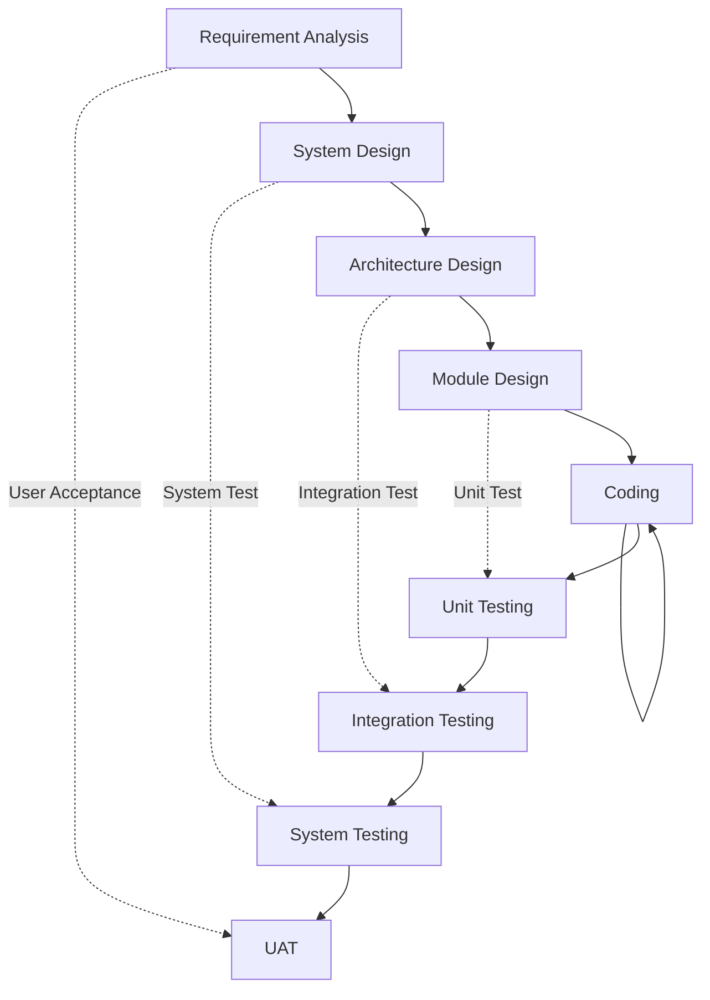

# 3.2 Verification và Validation

> **Tóm tắt một dòng**: Verification trả lời "Có đang xây sản phẩm đúng cách không?" (đúng đặc tả), Validation trả lời "Có đang xây đúng sản phẩm không?" (đáp ứng nhu cầu thực tế). Hai khái niệm khác nhau, dùng kỹ thuật khác nhau, và đều cần thiết.

## Tại sao bài này đứng trước SAT, SMT?

Trước khi đi vào thuật toán cụ thể, chúng ta cần định vị BMC trong bức tranh tổng thể của software engineering. Nếu bạn không hiểu BMC "đứng ở đâu" trong quy trình phát triển phần mềm, bạn sẽ khó biết khi nào dùng nó, và quan trọng hơn, **khi nào không cần dùng**.

Bài này trả lời ba câu hỏi:

1. Sự khác biệt giữa Verification và Validation là gì?
2. V-model là gì, và BMC nằm ở đâu trong V-model?
3. Khi tool tìm thấy bug, quy trình debug tiếp theo trông như thế nào?

## Verification và Validation: hai khái niệm rất dễ nhầm

Một câu nói rất hay của Barry Boehm (cha đẻ của mô hình spiral):

> *"Verification: Are we building the product right?"*  
> *"Validation: Are we building the right product?"*

Cùng dùng chữ "right" nhưng nghĩa khác hẳn nhau. Hãy phân tích từng cái.

**Verification** (kiểm chứng) hỏi: chương trình có làm đúng những gì đặc tả yêu cầu không? Giả sử đặc tả nói "hàm `sqrt(x)` trả về số $y$ thoả $y \cdot y \approx x$ với sai số dưới $10^{-9}$". Verification kiểm tra implementation của `sqrt` có thực sự đạt sai số đó không. Câu trả lời chỉ phụ thuộc vào hai thứ: đặc tả và code. Không cần biết "có ai dùng hàm này hay không", "có ích cho user không".

**Validation** (xác nhận) hỏi: cái mà ta đang xây có giải quyết đúng vấn đề mà người dùng cần không? Có khi đặc tả nói "tính `sqrt`" rất chính xác, nhưng người dùng thực ra cần `log` chứ không phải `sqrt`. Implementation đúng đặc tả nhưng không giải quyết đúng nhu cầu. Validation kiểm tra "tầng cao hơn": đặc tả có đúng với mục tiêu kinh doanh, có đúng với user story, có đúng với pháp luật và quy định.

Để dễ nhớ, đây là một phép loại suy quen thuộc: bạn order một chiếc bánh sinh nhật. Bạn nói với thợ làm bánh "tôi muốn bánh kem socola, hình tròn, đường kính 20cm". Thợ làm bánh xem xét đặc tả, dùng đúng nguyên liệu, đúng nhiệt độ lò, đúng thời gian. Cuối cùng giao bánh đúng tất cả mọi spec đó. Đây là **verification thành công**.

Nhưng giả sử bạn quên nói "không có hạt", và người ăn bánh dị ứng hạt. Đặc tả không đề cập, nên thợ làm bánh không sai. Tuy nhiên sản phẩm cuối **không đáp ứng nhu cầu thực**. Đây là **validation thất bại**.

Trong software:

| Tiêu chí | Verification | Validation |
|---|---|---|
| Câu hỏi | Code đúng spec không? | Spec đúng nhu cầu user không? |
| Đối tượng kiểm tra | Code vs spec | Spec vs reality |
| Kỹ thuật điển hình | BMC, code review, unit test, type check | User acceptance test, beta test, prototype |
| Người thực hiện | Developer, QA | Product manager, user |
| Thời điểm | Suốt SDLC, đặc biệt sau khi viết code | Đầu SDLC (requirement), cuối SDLC (UAT) |

:::tip[Nhớ bằng câu ngắn]
**V**erification = "**V**iết đúng" (làm đúng spec). **V**alidation = "**V**iết đáng" (làm đúng cái đáng làm).
:::

## Static và Dynamic Verification

Verification chia thành hai họ kỹ thuật chính dựa vào việc **có chạy chương trình không**.

**Static verification** không chạy chương trình. Tool đọc source code (hoặc bytecode, IR), phân tích nó như một đối tượng toán học. Ví dụ điển hình:
- Code review (thủ công).
- Type checking (compiler tự làm).
- Linter (ESLint, clang-tidy).
- Abstract interpretation (Astrée, Frama-C).
- Bounded Model Checking (CBMC, ESBMC).
- Theorem proving (Coq, Isabelle).

Ưu điểm: **không cần input để chạy**. Static analysis có thể chứng minh tính chất cho **mọi input** mà chương trình có thể nhận. Tool sound thậm chí cho ta proof là "không có bug nào trong scope đã verify".

Nhược điểm: bị giới hạn bởi tính undecidable của đa số property (định lý Rice). Mọi tool đều phải đánh đổi giữa soundness, completeness, scalability.

**Dynamic verification** chạy chương trình với input cụ thể, quan sát hành vi. Ví dụ điển hình:
- Unit test, integration test, e2e test.
- Fuzzing (AFL, libFuzzer).
- Runtime monitoring (AddressSanitizer, ThreadSanitizer).
- Property-based testing (QuickCheck, Hypothesis).

Ưu điểm: **đơn giản, scale tốt**. Bạn không cần tool đặc biệt để chạy code. Bug tìm thấy là bug thật, không phải false positive.

Nhược điểm: chỉ tìm bug, không chứng minh được "không có bug". Bị giới hạn bởi input space (đã phân tích ở [bài 2.1](../01-introduction/05-formal-verification-intro)).

| Tiêu chí | Static | Dynamic |
|---|---|---|
| Chạy code không? | Không | Có |
| Cần input không? | Không | Có |
| Phát hiện được "mọi bug"? | Có thể, nếu sound + complete | Không, chỉ bug có input tái tạo được |
| Tốc độ | Chậm hơn cho bug đơn giản | Nhanh cho bug đơn giản |
| False positive | Thường có | Hiếm |
| False negative | Tùy tool | Luôn có khả năng |

Trong tài liệu này, Lecture 3-4 dạy static (BMC + SMT), Lecture 5 dạy dynamic (fuzzing, monitoring). Hai họ này **bổ sung nhau**, không thay thế nhau.

## V-model: bản đồ vị trí của V&V trong SDLC

Trong các quy trình phát triển phần mềm truyền thống, V&V được tích hợp qua một mô hình tên là **V-model**. Tên gọi V đến từ hình dáng chữ V mà mô hình vẽ ra: bên trái xuống là các bước thiết kế từ trừu tượng tới chi tiết, bên phải lên là các bước kiểm tra từ chi tiết tới trừu tượng.

Mỗi tầng bên trái có một tầng kiểm tra tương ứng bên phải:

- **Requirement analysis** (yêu cầu) đối chiếu với **User Acceptance Testing** (UAT). UAT là validation: kiểm tra sản phẩm có đáp ứng nhu cầu user không.
- **System design** đối chiếu với **System Testing**: test toàn bộ hệ thống xem có đúng design không.
- **Architecture design** đối chiếu với **Integration Testing**: test các module ghép với nhau có đúng interface không.
- **Module design** đối chiếu với **Unit Testing**: test từng function, class theo spec.

BMC (như CBMC, ESBMC) hoạt động chủ yếu ở **tầng Unit Testing**, ở chỗ ta kiểm tra một function hoặc một module có thoả property cụ thể không. Nó là một dạng "unit test mạnh hơn" có khả năng chứng minh cho mọi input thay vì chỉ test một số input mẫu.

Mở rộng lên cao hơn, BMC còn dùng được ở **Integration Testing** khi ta gắn nhiều function lại và verify property cross-function. Tuy nhiên ở mức System Testing trở lên, BMC ít dùng vì state space quá lớn.

:::warning[V-model có thực sự dùng trong agile?]
V-model là khái niệm của thời waterfall. Trong agile/scrum hiện đại, các tầng V&V không tách biệt rạch ròi mà được làm song song trong từng sprint. Tuy nhiên các khái niệm "unit test", "integration test", "system test", "UAT" vẫn được sử dụng, và mối quan hệ V&V với từng tầng vẫn đúng. V-model có giá trị như một bản đồ khái niệm, không phải quy trình ép buộc.
:::

## V&V planning: khi nào làm gì?

Khi lên kế hoạch V&V cho một dự án, ta cần trả lời các câu hỏi sau:

**Property nào cần verify?** Liệt kê các thuộc tính (functional, security, performance, usability) mà sản phẩm phải có. Mỗi thuộc tính cần phương pháp test riêng. Security property như "no buffer overflow" phù hợp BMC. Performance property như "throughput > 1000 req/s" cần load test. Usability property cần user testing.

**Khi nào verify?** Sớm tốt hơn muộn. Quy tắc Boehm nổi tiếng: chi phí sửa bug tăng theo cấp số mũ qua các giai đoạn. Bug tìm thấy lúc requirement: \$1. Lúc design: \$5. Lúc code: \$10. Lúc test: \$50. Sau production: \$200 trở lên. Vì thế:

- Code review nên làm khi vừa viết xong, trước khi merge.
- Unit test nên có cùng commit với code (TDD).
- BMC nên chạy trong CI mỗi lần PR.
- Integration test có thể làm theo lịch hằng đêm.

**Ai làm?** Developer nên tự test trước khi merge (smoke test). QA độc lập làm test rộng hơn. Security team làm pen test cho production system.

**Tool nào?** Phụ thuộc tech stack:
- C/C++: CBMC, Frama-C, KLEE, AFL.
- Java: Java PathFinder (JPF), JBMC, Spotbugs.
- Smart contract: Certora, Manticore, Mythril.
- Python: pytest + mypy + bandit.

## Debugging: quá trình sau khi tool tìm bug

Khi tool báo bug, công việc của developer mới thực sự bắt đầu. Quy trình debug điển hình gồm năm bước:

**Bước 1: Tái tạo bug** (reproduce). Developer chạy lại với cùng input để xác nhận bug có thật, không phải artifact của test environment. Với BMC, tool đã cung cấp counterexample (input cụ thể), bước này nhanh. Với fuzzer, có thể cần thử lại nhiều lần với cùng seed.

**Bước 2: Cô lập bug** (localize). Xác định module, function, dòng code gây ra bug. Bước này dùng binary search, print debug, debugger (gdb, lldb). Với BMC, tool thường chỉ rõ assertion bị vi phạm và trace dẫn tới đó.

**Bước 3: Hiểu cơ chế** (understand). Tại sao bug xảy ra? Là off-by-one? Race? Type confusion? Bước này cần expertise về lớp lỗ hổng. Tài liệu này (Lecture 1-2) đã giới thiệu các lớp phổ biến.

**Bước 4: Sửa** (fix). Viết patch. Quan trọng: phải hiểu **root cause** trước khi sửa. Sửa symptom có thể che bug nhưng nó vẫn còn. Ví dụ, một crash do null pointer có thể được "sửa" bằng `if (p) { ... }`, nhưng câu hỏi đúng là: tại sao `p` lại null? Chỗ nào đáng nhẽ phải khởi tạo nó?

**Bước 5: Regression test** (ngăn tái phát). Viết test case từ counterexample. Khi sửa bug, test pass. Khi ai đó vô tình tái tạo bug trong tương lai, test fail ngay. Đây là cách dự án trưởng thành tích lũy "memory" về các bug đã sửa.

:::tip[Workflow BMC + regression test]
Một workflow rất hiệu quả khi dùng BMC: mỗi lần CBMC báo SAT (tìm bug), copy counterexample input ra một file `tests/counterexamples/bug_NNN.c`, biến nó thành unit test. Khi sửa bug, unit test pass. Khi merge PR, CI chạy cả CBMC (verify cho mọi input) lẫn unit test (test counterexample cũ). Hai lớp này bổ sung nhau: CBMC chống bug mới, unit test chống regression.
:::

## Tổng kết

- **Verification** kiểm tra code vs spec. **Validation** kiểm tra spec vs nhu cầu.
- **Static V** không chạy code, **Dynamic V** chạy code. Hai cách bổ sung nhau.
- **V-model** đặt V&V tương ứng với từng tầng SDLC. BMC chủ yếu ở tầng Unit và Integration.
- Quy trình debug: reproduce, localize, understand, fix, regression test. Counterexample từ BMC là điểm bắt đầu hoàn hảo cho regression test.

## Mini-quiz

Q1. Một sản phẩm pass tất cả unit test, integration test, system test nhưng người dùng không thèm dùng. Đây là vấn đề verification hay validation?

Validation thất bại. Mọi V (verification) thành công vì code làm đúng spec. Nhưng spec không đáp ứng đúng nhu cầu user (ví dụ tính năng không quan trọng, UI khó dùng, không phù hợp văn hóa địa phương). UAT đáng nhẽ phải phát hiện trước launch.

Q2. Tại sao BMC ít dùng cho System Testing?

System Testing kiểm tra toàn bộ ứng dụng đầu cuối, bao gồm UI, database, network, external service. Mỗi tầng này đem theo state riêng. State space của cả hệ thống quá lớn (số byte trong RAM database, số connection, số file descriptor) cho BMC encode.

BMC phù hợp ở tầng Unit và Integration nơi state space của một function hoặc một module vẫn manageable. Ở tầng System, ta dùng dynamic testing (e2e test, load test, chaos engineering) thay thế.

Q3. Khi tool BMC báo SAT với một counterexample, bước 1 trong quy trình debug (reproduce) đáng nhẽ rất nhanh. Vì sao đôi khi vẫn khó tái tạo?

Có vài lý do:
- BMC chạy trên model **trừu tượng** của chương trình. Counterexample có thể giả định một concrete value mà thực tế không thể đạt do environment (input từ network, file system) bị filter trước.
- BMC có thể model environment không chính xác. Ví dụ giả định một stdin đọc bất kỳ byte nào, nhưng thực tế stdin chỉ chứa printable characters.
- Counterexample đôi khi quá lớn để gõ thủ công (mảng 1000 phần tử). Cần tool sinh test case tự động từ counterexample.

Khi gặp tình huống "BMC SAT nhưng không reproduce được", thường vấn đề là **environment model**: cần thêm assumption vào BMC để loại trừ counterexample không khả thi trong thực tế.

---

**Tiếp theo**: [3.3 State space exploration](./03-state-space-exploration)
