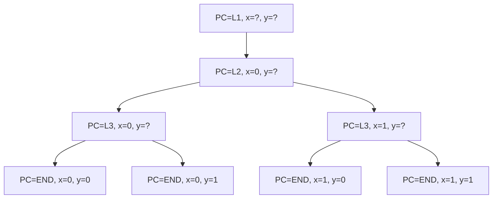

# 3.3 State space exploration: BFS, DFS và state explosion

> **Tóm tắt một dòng**: Mọi chương trình có thể được nhìn như một đồ thị state, kiểm chứng đồng nghĩa với khám phá đồ thị này tìm trạng thái xấu. BFS và DFS là hai chiến lược cơ bản nhất, mỗi cái có ưu nhược điểm riêng. Vấn đề lớn nhất là state explosion: số state lớn theo cấp số mũ.

## Tại sao bài này quan trọng?

Khi nghe "BMC dịch chương trình sang công thức rồi solver giải", ta dễ tưởng chỉ có một cách tiếp cận. Thực tế, BMC là **một** trong nhiều phương pháp khám phá state space của chương trình. Trước khi BMC ra đời, người ta dùng explicit-state model checking với BFS/DFS. Hiểu các phương pháp này giúp ta hiểu **vì sao BMC ra đời** và **khi nào nó vượt trội**.

Bài này trả lời:

1. Chương trình là một đồ thị state như thế nào?
2. BFS và DFS hoạt động ra sao, mỗi cái có thế mạnh gì?
3. State explosion là gì và có những kỹ thuật nào để chống?
4. Symbolic execution kết nối với BMC ra sao?

## Chương trình như một đồ thị state

Hãy bắt đầu với một ví dụ rất nhỏ:

```c
int x = 0;
int y = 0;
if (input1) x = 1;
if (input2) y = 1;
```

Mỗi state của chương trình tại một thời điểm có thể được mô tả bởi giá trị của hai biến `x` và `y` cùng với program counter (PC) chỉ instruction tiếp theo. Khi chương trình chạy, state thay đổi theo từng bước.

Đồ thị state cho chương trình trên (với `input1` và `input2` đều có thể là 0 hoặc 1):



Bốn state cuối là bốn outcome có thể xảy ra. Để verify một property, ta khám phá đồ thị này và kiểm tra mọi state cuối có thoả property không.

Quan trọng cần hiểu: số state này là $2^n$ nếu có $n$ biến boolean độc lập. Chương trình thực có nhiều biến int 32-bit, dẫn tới $2^{32}$ giá trị mỗi biến. Tổ hợp của $k$ biến int là $2^{32k}$. Đây chính là **state explosion problem** mà ta sẽ quay lại sau.

## Breadth-First Search (BFS)

BFS khám phá state theo lớp, từ gần tới xa. Bắt đầu từ initial state, thăm hết các state hàng xóm (depth 1), rồi tới hàng xóm của hàng xóm (depth 2), và cứ thế. Dùng một queue (FIFO) để lưu state đang chờ thăm.

Pseudocode:

```
function BFS(s0, property):
    queue = [s0]
    visited = {s0}
    while queue not empty:
        s = queue.pop_front()
        if not property(s):
            return CounterExample(s)
        for s' in successors(s):
            if s' not in visited:
                visited.add(s')
                queue.push_back(s')
    return Proof
```

**Thế mạnh chính của BFS**: khi tìm thấy counterexample, đó là counterexample **ngắn nhất** (ít transition nhất từ initial state). Điều này cực kỳ có ích cho debug: developer thấy được "chuỗi event tối thiểu" dẫn tới bug, dễ hiểu hơn nhiều so với một trace dài lê thê.

### Ví dụ BFS minh hoạ

Xét đồ thị state đơn giản (8 state, các transition như mũi tên):

```
        S0
       /  \
      S1    S2
     / |    | \
    S3 S4   S5 S6
              |
              S7 [BUG]
```

BFS từ S0 sẽ thăm theo thứ tự: S0, S1, S2, S3, S4, S5, S6, S7. Khi tới S7, phát hiện bug. Trace counterexample: S0 → S2 → S5 → S7 (3 bước).

DFS có thể thăm: S0, S1, S3, S4, S2, S5, S7. Trace counterexample cũng dẫn tới S7 nhưng phải khám phá nhiều state hơn trước khi tới đó (vì DFS đi sâu vào nhánh S1 trước).

### Nhược điểm BFS

BFS phải **lưu mọi state ở mỗi lớp** trong queue. Với đồ thị có branching factor $b$ và depth $d$, queue có thể chứa $b^d$ state. Memory tăng nhanh, dẫn tới out-of-memory ngay cả với chương trình nhỏ.

## Depth-First Search (DFS)

DFS khám phá theo nhánh, đi sâu nhất có thể rồi backtrack. Dùng một stack (LIFO) thay queue.

Pseudocode:

```
function DFS(s0, property):
    stack = [s0]
    visited = {s0}
    while stack not empty:
        s = stack.pop()
        if not property(s):
            return CounterExample(s)
        for s' in successors(s):
            if s' not in visited:
                visited.add(s')
                stack.push(s')
    return Proof
```

Bản chất DFS rất giống cách con người duyệt cây: đi xuống một nhánh tới khi gặp lá, quay lui, thử nhánh khác.

### Thế mạnh DFS

Memory của DFS chỉ là $O(d)$ (chiều sâu), tốt hơn BFS rất nhiều. Vì thế DFS scale tới depth lớn hơn.

DFS cũng tự nhiên với **symbolic execution**: mỗi nhánh trong DFS tương ứng với một path qua chương trình. Khi DFS đi sâu vào một nhánh, nó implicit "chọn" một path, và có thể tính path constraint dọc đường.

### Nhược điểm DFS

- Counterexample tìm được có thể dài hơn cần thiết (không tối ưu).
- Trong đồ thị có cycle, DFS có thể đi vào loop nếu không có visited check.
- Khó parallel hoá so với BFS (mỗi nhánh DFS phụ thuộc nhánh trước).

### Khi nào dùng cái nào?

| Tiêu chí | BFS phù hợp khi | DFS phù hợp khi |
|---|---|---|
| Memory | Đủ RAM | Chật RAM |
| Counterexample ngắn nhất | Cần | Không quan trọng |
| Depth lớn, branching nhỏ | Tốn RAM | Phù hợp |
| Depth nhỏ, branching lớn | Phù hợp | Có thể bỏ sót sớm |
| Parallel? | Dễ | Khó |

Trong thực tế, model checker như SPIN dùng DFS làm default vì memory là bottleneck chính. Tool như UPPAAL dùng kết hợp tuỳ scenario.

## State explosion problem

Đây là vấn đề trung tâm của model checking. Hãy hình dung một ví dụ cụ thể.

Một chương trình có:
- 10 biến boolean.
- 5 biến int 8-bit (giá trị 0 đến 255).
- Một mảng `arr[16]` chứa byte.

Số state khả dĩ là $2^{10} \times 256^5 \times 256^{16} = 2^{10} \times 2^{40} \times 2^{128} = 2^{178}$.

Số nguyên tử trong vũ trụ quan sát được vào khoảng $10^{80} \approx 2^{266}$. Nghĩa là state space của một chương trình nhỏ đã lớn cỡ một phần nhỏ của vũ trụ. Không có máy tính nào liệt kê hết được.

Hơn nữa, khi chương trình có $k$ thread, state explosion nhân lên: mỗi thread có vị trí PC riêng, và mọi interleaving giữa các thread đều là state riêng. Số interleaving của $k$ thread, mỗi thread $n$ instruction, là $\frac{(kn)!}{(n!)^k}$. Với $k = 4, n = 10$ đã là $\approx 10^{19}$. Đây là chủ đề chính của [Lecture 4](../03-static-analysis-ii/01-overview).

### Các kỹ thuật chống state explosion

Có ba họ kỹ thuật chính:

**Symbolic representation** thay vì liệt kê từng state, biểu diễn cả tập state bằng một công thức. Ví dụ thay vì lưu 256 state $\{x = 0, x = 1, \ldots, x = 255\}$, lưu công thức $0 \leq x \leq 255$. Đây là nền tảng của symbolic model checking và BMC.

**Partial-order reduction** với chương trình concurrent: nếu hai instruction từ hai thread giao hoán (không ảnh hưởng nhau), chỉ cần khám phá một thứ tự, không cần cả hai. Giảm số interleaving phải khám phá.

**Abstract interpretation** thay vì giá trị chính xác, dùng abstract domain (interval, polyhedra) over-approximate. Số abstract value nhỏ hơn nhiều, không bị explosion.

## Symbolic execution: cầu nối giữa BFS/DFS và BMC

Trước khi đi vào SAT/SMT chi tiết, ta nên hiểu **symbolic execution** vì nó là cầu nối tự nhiên từ DFS truyền thống sang BMC.

Ý tưởng: thay vì chạy chương trình với input cụ thể, chạy với input **symbolic** (biến chưa biết giá trị). Khi gặp `if (x > 5)`, ta không quyết định nhánh nào ngay, mà **fork** thành hai world: một world giả định $x > 5$, một world giả định $x \leq 5$. Mỗi world tích lũy **path constraint** dọc đường.

Ví dụ:

```c
int abs(int x) {
    if (x >= 0)
        return x;
    else
        return -x;
}
```

Symbolic execution với input $x$ symbolic:

- Path 1: giả định $x \geq 0$. Path constraint: $x \geq 0$. Return value: $x$.
- Path 2: giả định $x < 0$. Path constraint: $x < 0$. Return value: $-x$.

Nếu ta muốn check property "return value ≥ 0", với mỗi path:
- Path 1: cần $x \geq 0 \land x < 0$. Solver trả UNSAT, không vi phạm property.
- Path 2: cần $x < 0 \land -x < 0$, tức $x < 0 \land x > 0$. UNSAT.

Cả hai path đều OK, property chứng minh được.

Nhưng nếu encode bitvector 32-bit, path 2 cần $x < 0 \land -x < 0$. Trong bitvector, $x = $ INT_MIN cho $-x = $ INT_MIN (overflow). Solver tìm được model $x = -2^{31}$, vi phạm property. Counterexample này chính xác lại là cái mà BMC tìm được ở [bài 2.2](../01-introduction/06-bmc-and-smt-basics).

Symbolic execution và BMC rất gần nhau về bản chất. Sự khác biệt:

| Tiêu chí | Symbolic Execution | BMC |
|---|---|---|
| Khám phá theo | Path (forward) | Encode toàn bộ thành 1 công thức |
| Số gọi solver | Nhiều (1 lần / path) | 1 lần (cho toàn formula) |
| Path explosion | Vấn đề chính | Ẩn trong solver |
| Tool | KLEE, SAGE, S2E | CBMC, ESBMC |

KLEE là tool symbolic execution nổi tiếng nhất, dùng để tìm bug trong coreutils, libc, kernel driver.

## DFS vs BFS với cycle: visited set quan trọng

Một điểm thực dụng cần lưu ý: trong đồ thị state có cycle (ví dụ chương trình có loop), nếu DFS không check visited, nó sẽ đi vào loop vô hạn.

```python
def dfs_buggy(s):
    if not property(s):
        return CounterExample(s)
    for s_next in successors(s):
        dfs_buggy(s_next)   # KHÔNG check visited!
```

Phiên bản đúng:

```python
def dfs_correct(s, visited):
    if s in visited:
        return
    visited.add(s)
    if not property(s):
        return CounterExample(s)
    for s_next in successors(s):
        dfs_correct(s_next, visited)
```

Trong chương trình thực, "state" có thể là tổ hợp giá trị mọi biến + PC, rất khó hash. Tool model checker dùng các kỹ thuật như Bloom filter, BDD canonical form để check visited hiệu quả.

## Tóm tắt và chuyển tiếp

- **State space** của chương trình là đồ thị; verify là khám phá đồ thị tìm bad state.
- **BFS** tìm counterexample ngắn nhất nhưng tốn RAM. **DFS** tiết kiệm RAM nhưng counterexample dài.
- **State explosion** là vấn đề trung tâm: số state lớn theo cấp số mũ với số biến.
- **Symbolic representation** (phần BMC + SMT) là cách giảm state explosion hiệu quả nhất.
- **Symbolic execution** là cầu nối: chạy chương trình với input symbolic, tích lũy path constraint, gọi SMT giải.

Trong các bài tiếp theo, ta đi sâu vào hai thành phần của SMT: SAT (bài 3.4) và theory (bài 3.5).

## Mini-quiz

<details>
<summary>Q1. Vì sao BFS cho counterexample ngắn nhất nhưng DFS không?</summary>

BFS khám phá state theo lớp: lớp 1 (depth 1), lớp 2 (depth 2), và cứ thế. Khi tới một bad state, đó là bad state đầu tiên trong thứ tự thăm, tức **gần initial state nhất** (depth nhỏ nhất). Counterexample là path từ initial tới bad, độ dài chính là depth.

DFS đi sâu vào một nhánh trước khi backtrack. Bad state đầu tiên gặp có thể nằm ở nhánh sâu mà DFS chọn ngẫu nhiên, không nhất thiết là bad state gần nhất. Ví dụ trong đồ thị nhỏ ở phần BFS, DFS có thể thăm S3, S4 (depth 2) trước S7 (depth 3), nhưng nếu bad state là S7, DFS vẫn cần đi qua S1, S3, S4 trước khi backtrack tới S2 → S5 → S7.
</details>

<details>
<summary>Q2. State explosion là gì? Cho một ví dụ định lượng.</summary>

State explosion là hiện tượng số state khả dĩ của chương trình tăng theo cấp số mũ với số biến. Ví dụ định lượng:

- 10 biến boolean: $2^{10} = 1024$ state.
- Thêm 1 int 32-bit: $1024 \times 2^{32} \approx 4 \times 10^{12}$ state.
- Thêm mảng 100 byte: $4 \times 10^{12} \times 2^{800} \approx$ vượt số nguyên tử trong vũ trụ.

Hệ quả: explicit-state model checking (liệt kê từng state) không scale được với chương trình thực tế. Phải dùng symbolic representation (BMC + SMT) hoặc abstract interpretation.
</details>

<details>
<summary>Q3. Symbolic execution và BMC khác nhau cụ thể ở điểm nào?</summary>

Cả hai đều dùng SMT solver, nhưng cách "đặt câu hỏi" khác nhau:

**Symbolic execution** chạy chương trình theo path, mỗi path tích lũy path constraint. Khi đến nhánh, fork thành nhiều world. Khi đến assertion, gọi solver với constraint của path hiện tại. Nhiều lần gọi solver (một lần mỗi path).

**BMC** encode toàn bộ chương trình (mọi path khả dĩ trong bound $k$) thành **một công thức duy nhất** $\Phi_k$, rồi gọi solver một lần. Solver tự khám phá path nào dẫn tới counterexample.

Tradeoff:
- SymExec dễ song song hoá (mỗi path là một task riêng), nhưng path explosion làm số task lớn.
- BMC chỉ một query nhưng formula khổng lồ, solver phải khám phá nội bộ.

Trong thực tế, hai approach hội tụ: hầu hết tool BMC hiện đại có thể coi như "lazy symbolic execution" và ngược lại.
</details>

---

**Tiếp theo**: [3.4 SAT và DPLL](./04-sat-and-dpll)
