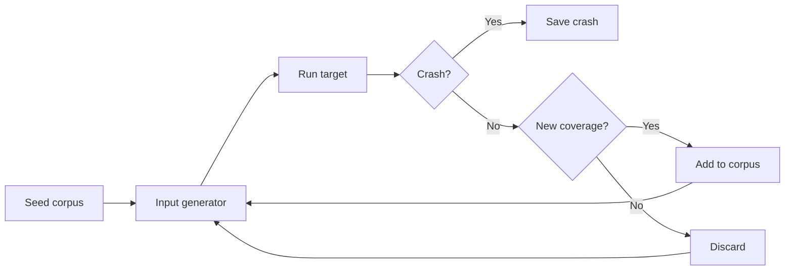

# 5.5 Fuzzing basics: ý tưởng đơn giản, sức mạnh không tưởng

> **Tóm tắt một dòng**: Fuzzing là kỹ thuật tự động sinh input ngẫu nhiên (hoặc semi-random) để đẩy cho chương trình, mục tiêu tìm crash, hang hay vi phạm assertion. Đơn giản đến nỗi sinh viên đại học cũng implement được, nhưng đã tìm hàng nghìn CVE trong các phần mềm quan trọng nhất thế giới.

## Một câu chuyện ngắn về Fuzzing

Năm 1989, giáo sư Barton Miller tại University of Wisconsin nhận xét: trong một cơn bão, terminal của ông bị nhiễu, gửi ký tự ngẫu nhiên vào Unix shell. Shell crash. Ông nghĩ: "nếu nhiễu ngẫu nhiên crash shell, vậy mọi Unix utility có chịu được random input không?"

Ông tạo một tool đơn giản: sinh chuỗi byte ngẫu nhiên, feed cho mọi command line Unix utility (`ls`, `grep`, `awk`, ...). Kết quả gây sốc: **25-33% utility crash** trong 5 phút testing. Bug từ năm 1980s vẫn chưa được phát hiện.

Đây là khởi nguồn của **fuzzing**. Từ "fuzz" lấy từ trên đường (radio fuzz = nhiễu).

35 năm sau, fuzzing đã phát triển thành một ngành lớn. Google **OSS-Fuzz** chạy fuzzer 24/7 trên 500+ open-source project, tìm 60,000+ bug từ 2016. Microsoft **OneFuzz** tương tự cho code Microsoft. Hầu hết bug Heartbleed-tầm-cỡ trong thập kỷ qua đều được phát hiện bởi fuzzer chứ không phải pen tester hay code review.

Tại sao đơn giản nhưng hiệu quả? Vì code thực tế **đầy edge case** mà developer không nghĩ tới khi viết. Random input chạm vào edge case nhanh hơn dù không có pattern.

## Fuzzing pipeline điển hình

Pipeline fuzzing 4 bước:



**Seed corpus**: tập input ban đầu, "good examples" mà developer cung cấp. Ví dụ với PDF fuzzer, seed là vài PDF hợp lệ.

**Input generator**: từ corpus hiện tại, sinh input mới. Hai chiến lược:
- **Generation-based**: sinh input từ scratch theo grammar/template.
- **Mutation-based**: lấy input từ corpus, "mutate" (flip bit, insert bytes, delete) tạo input mới.

**Run target**: chạy chương trình với input. Có thể là binary, library, network service. Phải instrument để detect crash.

**Crash detection**: native crash (segfault, abort), assertion failure, sanitizer alert (ASan, MSan).

**Coverage feedback**: nếu input mới khám phá branch/path chưa từng thấy, add vào corpus. Loop tiếp.

## Random testing thuần (Naive fuzzing)

Cách đơn giản nhất: sinh input hoàn toàn ngẫu nhiên, không nhìn lại code.

```python
import random
import subprocess

while True:
    n = random.randint(1, 10000)
    data = bytes(random.randint(0, 255) for _ in range(n))
    result = subprocess.run(['./target'], input=data, timeout=5)
    if result.returncode != 0:
        save_crash(data)
```

Đơn giản 10 dòng code. Đây là cách Miller thí nghiệm 1989.

**Ưu**: cực kỳ dễ implement. Không cần biết internals.

**Nhược**: rất chậm tìm bug "deep" cần input có cấu trúc. Ví dụ JSON parser, random byte hầu như chắc chắn fail ở parse level đầu tiên. Bug ở deep logic (sau khi parse xong) không bao giờ được test.

Random testing có giá trị làm baseline, nhưng modern fuzzing dùng kỹ thuật smarter.

## Vì sao fuzzing mạnh đến vậy?

Có nhiều giả thuyết về sự thành công của fuzzing:

**Giả thuyết 1: Code có nhiều edge case "không suy nghĩ"**. Developer test happy path và một vài sad path. Code phải handle hàng triệu edge case (empty input, huge input, malformed byte at offset X, unicode normalization, integer overflow trong size calculation, ...). Random input chạm các edge case đó.

**Giả thuyết 2: Memory bug rất phổ biến trong C/C++**. Buffer overflow, use after free, double free, ... 70% CVE trong Chromium, Linux kernel là memory bug. Fuzzer + sanitizer phát hiện 99% memory bug trong phần code đã chạm.

**Giả thuyết 3: Coverage tự động cập nhật.** Coverage-guided fuzzing (AFL) tự learn từ chương trình mà không cần human guidance. Càng chạy lâu, càng tốt.

**Giả thuyết 4: Parallel scaling**. Fuzzer có thể chạy 1000 instance song song trên cloud. Cost vài USD/giờ cho 1000 core, tìm được bug mà 1 pen tester tìm cả tháng không ra.

## Khi nào fuzzing hiệu quả nhất?

Fuzzing hoạt động tốt cho:

**Parsers**: file format (PDF, image, video), network protocol (HTTP, DNS), serialization (JSON, XML). Mọi parser từng được fuzz đều tìm thấy bug.

**Stateless code**: function thuần tuý (hash, encrypt, compress). Easy to fuzz, no setup needed.

**Crypto primitive**: implementation detail của AES, RSA, hash. Fuzzer tìm side-channel, edge case về key derivation.

**Sandbox boundary**: JIT compiler, eBPF verifier, Wasm runtime. Bug ở đây có security impact lớn.

Kém hiệu quả cho:

**Stateful service** với deep state machine: cần input theo chuỗi để vào state interesting. Random byte không đủ.

**GUI / event-driven**: cần simulate user action, không phải input file.

**Concurrent code**: thread interleaving không tự nhiên trong fuzzing. Cần concurrency-aware fuzzer.

## Tool fuzzing trong thực tế

**AFL** (American Fuzzy Lop, 2013): coverage-guided mutation-based. Có lẽ là fuzzer ảnh hưởng nhất. Tìm hàng nghìn bug trong OpenSSL, sqlite, libpng. Chi tiết ở bài 5.6.

**AFL++**: fork của AFL với nhiều cải tiến. Active maintain.

**libFuzzer**: in-process fuzzer của LLVM/Clang. Faster than AFL vì không fork process. Phù hợp cho library code.

**Honggfuzz**: Google's fuzzer, hỗ trợ AFL-style + perf counter feedback.

**syzkaller**: Google's kernel fuzzer. Tìm hàng nghìn bug trong Linux kernel.

**OSS-Fuzz**: platform của Google chạy fuzzer trên open-source project. Free tier cho project bất kỳ.

**peach**: commercial generation-based fuzzer cho network protocol.

## Continuous Fuzzing trong CI

Modern practice: fuzz trong CI pipeline, không phải one-off.

**ClusterFuzz** (Google): chạy fuzzer 24/7 trên cluster. Khi tìm bug, auto file ticket, assign developer.

**OSS-Fuzz integration**: project có fuzz target được Google fuzz miễn phí trên cluster của họ. Bug fixing dưới 30 ngày.

**Coverage growth tracking**: theo dõi coverage qua thời gian. Coverage stagnate = fuzzer stuck, cần thêm seed corpus hoặc cải tiến grammar.

## Tóm tắt

- **Fuzzing** sinh input tự động để tìm crash/hang.
- Lịch sử: Miller (1989) random byte → modern AFL (2013) coverage-guided.
- Đơn giản nhưng hiệu quả nhờ code có nhiều edge case không suy nghĩ.
- Hiệu quả nhất cho parser, stateless code, crypto primitive.
- Tool chính: AFL, libFuzzer, syzkaller, honggfuzz.
- Modern: continuous fuzzing trong CI với ClusterFuzz, OSS-Fuzz.

## Mini-quiz

<details>
<summary>Q1. Random testing thuần và coverage-guided fuzzing khác nhau thế nào?</summary>

**Random testing thuần**: sinh input hoàn toàn ngẫu nhiên, không feedback từ chương trình. Mỗi iteration độc lập.

**Coverage-guided fuzzing**: lấy seed từ corpus, mutate. Sau khi chạy, check coverage. Nếu input mới khám phá branch chưa thấy, **giữ lại trong corpus**. Lần mutate sau lấy seed này (đã thấy branch mới), có cơ hội đi sâu hơn.

Ví dụ: parser cần password đầu file để vào critical code. Random testing chắc gần như không bao giờ sinh đúng password. Coverage-guided: một input ngẫu nhiên may mắn pass password check → vào critical code → coverage tăng → giữ input. Mutate input đó cho lần sau, "memorize" password rồi từ từ explore critical code.

Coverage-guided thắng random testing ở các bug "deep" (cần input cấu trúc).
</details>

<details>
<summary>Q2. Vì sao Miller 1989 phát hiện ra 25-33% Unix utility crash với random input?</summary>

Có nhiều lý do:

**Lý do 1**: Unix utility được viết trong 1970s-1980s khi chưa có culture defensive coding. Code giả định input "reasonable" (có newline ở cuối, không quá dài, ...).

**Lý do 2**: C language không có bounds check. Buffer overflow, integer overflow rất dễ xảy ra với input lạ.

**Lý do 3**: Hệ thống file/process model phức tạp. Argv quá dài, stdin có byte NUL ở giữa, file descriptor close giữa chừng - đủ thứ tình huống developer không test.

**Lý do 4**: Không có tool fuzzing trước Miller. Bug từ thập kỷ 80 nằm trong code không ai thử.

Nhưng quan trọng nhất: random byte chạm các edge case mà developer không nghĩ tới. Đây là insight gốc của fuzzing, vẫn đúng ngày nay.
</details>

<details>
<summary>Q3. Tại sao fuzzing không hiệu quả cho GUI testing?</summary>

GUI có hai thách thức:

**Input phức tạp hơn byte**: input GUI là sequence event (click, key, drag) với timing. Random click vô nghĩa không trigger flow logic.

**State machine sâu**: để test feature ở 10 click deep, fuzzer cần sinh 10 click đúng theo flow. Random click hầu như chắc chắn đi lạc.

Cần **GUI-aware fuzzer**: hiểu DOM/widget tree, biết click vào button nào dẫn tới dialog nào. Tool như **Sapienz** (Facebook) dùng evolutionary algorithm + GUI awareness để fuzz mobile app.

Trong web context: **Burp Suite** + custom extension có thể "fuzz form" theo flow login → action → submit. Tốt hơn random nhưng vẫn không gần độ hiệu quả của file format fuzzing.
</details>

---

**Tiếp theo**: [5.6 Black-box fuzzing (AFL, grammar, mutation)](./06-blackbox-grammar-mutation)
