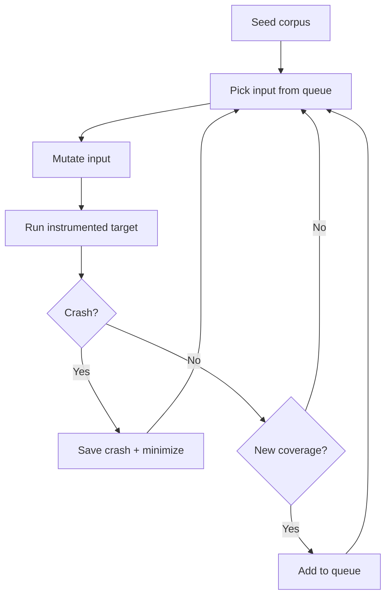

# 5.6 Black-box fuzzing: AFL, grammar và mutation

> **Tóm tắt một dòng**: Black-box fuzzing sinh input **mà không phân tích source code** (chỉ binary và optionally coverage instrument). Hai chiến lược chính: **mutation-based** (AFL) lấy seed corpus mutate ngẫu nhiên với feedback coverage; **grammar-based** sinh input theo grammar/template formal. AFL là king cho code C/C++ không cấu trúc cao, grammar là king cho input structured (network protocol, JSON, SMT).

## Hai trường phái

Black-box fuzzing có hai cách "sinh input":

**Mutation-based**: bắt đầu từ seed corpus (input mẫu hợp lệ), apply mutation (flip bit, insert bytes, delete byte) để tạo input mới. Mutation random hoặc có heuristic.

**Generation-based** (a.k.a. grammar-based): không cần seed, sinh input từ scratch theo grammar formal mô tả format.

Hai trường phái không loại trừ nhau. Modern fuzzer thường combine: grammar để sinh seed initial, mutation để explore variant.

## AFL: kẻ đặt nền tảng coverage-guided mutation

**AFL (American Fuzzy Lop)**, 2013 bởi Michał Zalewski, là coverage-guided mutation-based fuzzer. AFL đã trở thành "gold standard" mà mọi fuzzer modern so sánh với.

### AFL workflow



Bốn ý tưởng cốt lõi:

### Ý tưởng 1: Compile-time instrumentation

AFL không observe coverage qua debugger (chậm). Thay vào đó, compile target với AFL compiler (`afl-gcc`, `afl-clang`). Compiler chèn instrumentation code vào mọi basic block:

```c
// Mỗi basic block sau instrumentation:
void original_basic_block() {
    afl_track_branch(BLOCK_ID);   // <-- added by AFL compiler
    // ... original code ...
}
```

`afl_track_branch` ghi vào shared memory map: "đã đi qua từ block A sang block B". Map này gọi là **AFL bitmap**, kích thước 64KB.

Sau khi target chạy, AFL đọc bitmap, so sánh với bitmap "đã thấy". Nếu có entry mới (transition mới), input này có coverage mới.

### Ý tưởng 2: Forkserver

AFL không exec target mỗi lần. Thay vào đó dùng **forkserver**: target được start một lần, mỗi test case fork một process con, exec input, exit. Tiết kiệm cost loader, dynamic linker.

Trên Linux modern, AFL có thể chạy 1000-10000 test/giây trên 1 core.

### Ý tưởng 3: Energy schedule

AFL không treat mọi seed bằng nhau. Mỗi seed có "energy" = số mutation áp dụng. Energy cao cho seed:
- Mới (chưa được mutate nhiều).
- Đến từ chỗ "rare" của coverage map.
- Nhỏ và nhanh.

Algorithm: weighted random pick từ queue.

### Ý tưởng 4: Mutation strategy

AFL không mutate ngẫu nhiên thuần. Có chiến lược layered:

1. **Bit flip**: lật 1 bit, 2 bit, 4 bit liền kề.
2. **Byte flip**: lật 1 byte.
3. **Arithmetic**: cộng/trừ giá trị nhỏ vào byte/word/dword.
4. **Interesting values**: thay byte bằng giá trị "interesting" (0, 1, -1, INT_MAX, ...).
5. **Dictionary**: insert keyword từ dictionary (token, magic number).
6. **Havoc**: random combination của trên.
7. **Splice**: ghép 2 seed thành 1.

Mỗi strategy thử cho mỗi seed, ưu tiên strategy chưa thử.

### Ưu điểm AFL

- **Bug detection**: tìm hàng nghìn CVE trong OpenSSL, libpng, sqlite, libxml2, ...
- **Generic**: chạy được cho mọi target có instrument được.
- **Self-tuning**: energy schedule + coverage feedback tự động improve.
- **Open source**, miễn phí, mature.

### Nhược điểm AFL

- **Chậm cho deep coverage**: cần thời gian dài (giờ, ngày) để khám phá branch sâu.
- **Khó cho input structured**: AFL random mutation hỏng input format ngay (JSON parser, AFL mutation tạo invalid JSON).
- **Phụ thuộc seed corpus**: corpus thiếu diversity → coverage thấp.

### AFL++ và biến thể

**AFL++** (2019): fork với nhiều cải tiến: better mutator (CmpLog), better energy schedule, parallel modes. Tốc độ tìm bug 2-5x AFL gốc.

**libFuzzer** (LLVM): in-process variant. Faster cho library code (không fork overhead).

**Honggfuzz**: tương tự AFL, hỗ trợ Linux perf counter (CPU branch counter).

## Mutation strategies sâu hơn

### Bit-level mutation

Thay đổi bit pattern. Ví dụ input `0x41` (ASCII 'A'):
- Flip bit 0: `0x40` (ASCII '@').
- Flip bit 7: `0xC1` (high bit set).

Hữu ích cho bug ở mức bit (bit field, packed struct).

### Byte-level mutation

Random byte. Insert byte ở vị trí ngẫu nhiên. Delete byte. Hữu ích cho length-prefixed format.

### Interesting values

Hard-coded "interesting" values:
- 0 (off-by-one trigger).
- 1, -1.
- INT_MIN, INT_MAX, UINT_MAX.
- 0x7F, 0x80, 0xFF (boundary của signed byte).
- 0xDEADBEEF, 0xCAFEBABE (magic).

Thay byte/word/dword bằng các giá trị này. Hiệu quả cao vì developer thường test happy path nhưng bug ở boundary.

### Dictionary

Tập keyword đặc thù cho format. Ví dụ HTTP fuzzer: `GET, POST, Content-Type, application/json, Authorization, Basic`. Insert keyword vào input.

Cho format có magic header (PNG: `89 50 4E 47`), dictionary đảm bảo seed luôn có magic, tránh fuzzer waste time trying random byte ở header.

### Splice

Lấy 2 seed, cut tại offset ngẫu nhiên, ghép half của một với half của kia. Tạo input "trộn" tính chất 2 seed.

Hữu ích khi 2 seed có 2 feature khác nhau, splice tạo input có cả hai.

## Grammar-based fuzzing

Cho input structured (JSON, XML, SQL, C source code), mutation random hỏng input ngay. Cần **grammar** để sinh valid input.

### Định nghĩa Grammar

Context-Free Grammar (CFG) là quy tắc sản xuất:

```
JSON       → Object | Array | String | Number | "true" | "false" | "null"
Object     → "{" Members? "}"
Members    → Pair ("," Pair)*
Pair       → String ":" JSON
Array      → "[" Elements? "]"
Elements   → JSON ("," JSON)*
String     → "\"" Char* "\""
Number     → ... (regex for number)
Char       → ... (any ASCII excluding " and \)
```

Fuzzer random walk grammar, mỗi nonterminal expand ngẫu nhiên một option.

Ví dụ output:

```json
{"key1": [1, 2, {"nested": "value"}], "key2": true}
```

Valid JSON. Fuzzer test parser với input cấu trúc đúng nhưng nội dung varied.

### Tool grammar fuzzer

**Peach** (commercial, network protocol).

**Sulley**: framework Python cho grammar fuzzing.

**Domato** (Google): JS grammar fuzzer cho browser engine. Tìm hàng trăm bug Chrome.

**LangFuzz**: grammar fuzzer cho JavaScript interpreter (V8, SpiderMonkey).

**Csmith**: grammar fuzzer cho C source code. Test compiler. Tìm 400+ bug trong GCC, Clang, LLVM.

### Grammar + mutation hybrid

Modern fuzzer combine cả hai:

1. Grammar sinh seed initial valid.
2. Mutation tweak seed: flip bit ở value (giữ structure).

Tool: **Grammarinator** (combine grammar + AFL).

## Black-box vs Coverage feedback

Câu hỏi: "black-box" có nghĩa "no info from target" hay "no source code"?

**Definition strict**: no info, không cần instrumentation. Random input + check crash. Naive Miller-style.

**Definition loose** (modern): không cần source code, nhưng có thể có coverage info qua binary instrumentation (PIN, DynamoRIO) hoặc shadow library.

AFL fits "loose": cần compile với afl-gcc, nhưng không cần đọc source code. Đó là "gray-box" theo strict, nhưng cộng đồng gọi là "black-box coverage-guided".

White-box (bài 5.7) là dùng symbolic execution, requires source-level analysis.

## Khi nào dùng mutation, khi nào grammar?

| Tình huống | Khuyến nghị |
|---|---|
| File format binary (PDF, PNG) | Mutation (AFL) với seed corpus đa dạng |
| Network protocol structured (DNS, HTTP) | Grammar hoặc mutation + dictionary |
| Programming language interpreter | Grammar (Domato, LangFuzz) |
| Library API | libFuzzer với corpus structured |
| Stateless function | AFL hoặc libFuzzer |
| Compiler | Grammar (Csmith) |
| Web app | Burp Suite + custom |

Nếu nghi ngờ, bắt đầu với AFL/libFuzzer + good seed corpus. Quan sát coverage. Nếu stuck ở tầng parser, thêm grammar.

## Tóm tắt

- **AFL** đặt nền tảng coverage-guided mutation-based fuzzing.
- Bốn ý tưởng AFL: compile instrumentation, forkserver, energy schedule, mutation strategy.
- **Grammar fuzzing** sinh input từ grammar formal, hiệu quả cho structured input.
- Modern thường **hybrid** grammar + mutation.
- Tool: AFL/AFL++, libFuzzer, Honggfuzz, Csmith, Domato.

## Mini-quiz

<details>
<summary>Q1. Vì sao AFL dùng forkserver thay vì exec target mỗi test?</summary>

Exec a process tốn nhiều CPU: load ELF, resolve dynamic linker, init constructor. Trên Linux thường 5-50 ms.

Forkserver: target được init một lần, đợi command. Mỗi test case, target fork một child, child exec input, exit. Fork nhanh hơn exec (1-2 ms).

Tốc độ: AFL với forkserver chạy 1000-10000 test/giây trên 1 core. Không có forkserver: ~100 test/giây. Speedup 10-100x.

Hệ quả: fuzzing campaign hiệu quả khi run lâu (giờ/ngày). Forkserver biến hours work thành minutes.
</details>

<details>
<summary>Q2. Tại sao mutation-based fuzzing kém hiệu quả cho JSON parser nếu không có grammar?</summary>

JSON có structure rigid: bracket phải match, comma giữa elements, quote bao key/value. Bit flip random gần như chắc chắn tạo invalid JSON.

Ví dụ seed: `{"key": "value"}`. Flip 1 bit ở `"key"` thành `"jey"`. Vẫn valid. Flip bit ở `{` thành `0`. Invalid JSON, parser fail ngay token đầu. Bug ở deep code (sau parse OK) không được test.

Hệ quả: AFL mutation cho JSON parser thường stuck ở coverage thấp (chỉ chạm "parse failed" branch).

Giải pháp:
- **Grammar**: sinh JSON valid từ grammar, mutate ở "leaf" (string content, number).
- **Custom mutator**: write hàm mutate JSON-aware (insert key, change value, add nested), không phải bit flip.
- **libFuzzer + structured fuzzing**: dùng `LLVMFuzzerCustomMutator` hook để custom mutate.
</details>

<details>
<summary>Q3. Csmith fuzz compiler thế nào? Bug tìm là loại gì?</summary>

**Csmith** sinh **C program ngẫu nhiên** theo grammar tinh vi (giữ C valid, không UB). Sinh hàng nghìn program, compile với GCC, Clang, ICC.

Bug tìm là **compiler miscompilation**: compiler bug khiến output binary chạy sai. Để detect:

**Differential testing**: compile cùng program với 3 compiler (GCC, Clang, ICC), chạy với cùng input, so output. Nếu khác → ít nhất 1 compiler có bug.

**Self-test**: program kết thúc với checksum của state. Nếu checksum khác giữa 3 compile, bug.

Csmith đã tìm 400+ bug trong các compiler lớn từ 2008. Hầu hết là bug optimization sai (compiler tin tưởng UB không xảy ra, optimize aggressively, kết quả sai).

Đây là ví dụ điển hình grammar fuzzing thành công: grammar formal C → valid program → differential test → compiler bug.
</details>

---

**Tiếp theo**: [5.7 White-box fuzzing (dynamic symbolic execution)](./07-whitebox-fuzzing-symbolic)
