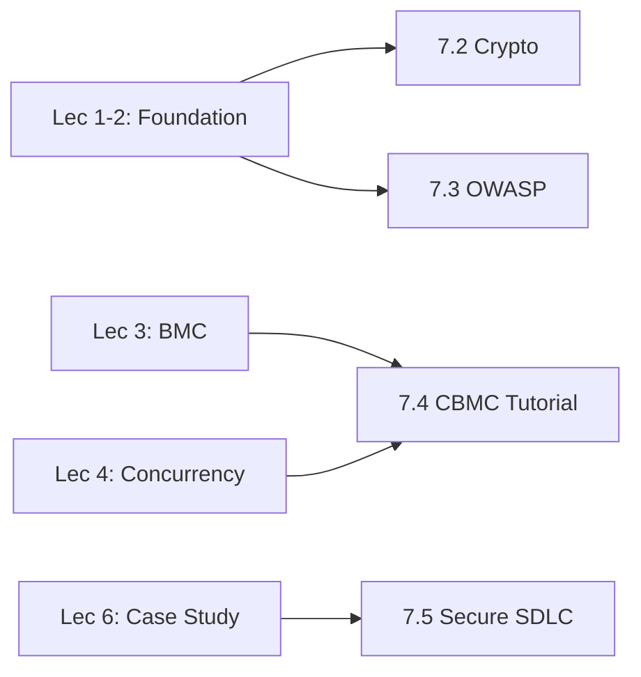

# Lecture 7: Topics Bổ sung

> **Tóm tắt một dòng**: Phần này gồm 4 bài độc lập, bổ sung kiến thức quan trọng mà không nằm trong scope chính của Lec 1-6. Bạn có thể đọc theo nhu cầu, không cần tuần tự.

## Vì sao có phần này?

Năm phần trước (Lec 1-5 + Case Study) tạo thành một curriculum hoàn chỉnh về Software Security. Tuy nhiên, có một số chủ đề **rất quan trọng trong thực tế** nhưng không vào được bất kỳ phần nào ở trên một cách tự nhiên:

- **Cryptography** xuất hiện khắp nơi nhưng cần một bài riêng để hiểu cơ bản.
- **OWASP Top 10** là tham chiếu industry, đã list trong Case Study nhưng mỗi mục đáng có 1 section riêng.
- **CBMC tutorial** là thực hành cụ thể, khác với phần concept của Lec 3-4.
- **Secure SDLC** là góc nhìn process, bổ sung cho góc nhìn technical.

Phần 7 này là "appendix mở rộng" cho người muốn đi sâu hoặc cần reference khi làm dự án thực.

## Bốn bài trong phần

| Bài | Chủ đề | Mức độ cần thiết |
|---|---|---|
| **7.1** Tổng quan (bài này) | Định vị phần | - |
| **7.2** [Cryptography basics](./02-cryptography-basics) | Hash, MAC, RSA, AES, PKI | Cao: hỗ trợ hiểu CIA và phân biệt với Software Security |
| **7.3** [OWASP Top 10 chi tiết](./03-owasp-top-10) | 10 lớp lỗ hổng web phổ biến | Rất cao cho web developer |
| **7.4** [CBMC Tutorial](./04-cbmc-tutorial) | Cài đặt và chạy CBMC trên code C thực | Cao cho thực hành |
| **7.5** [Secure SDLC + SDL + SAMM](./05-secure-sdlc) | Process integration | Trung bình, hữu ích cho team lead |

## Cách đọc

- **Nếu bạn đang làm web app**: đọc 7.3 (OWASP Top 10) trước, sau đó 7.2 (Crypto) nếu cài đặt auth/payment.
- **Nếu bạn muốn thực hành verification**: đọc 7.4 (CBMC tutorial), thử trên code của mình.
- **Nếu bạn là team lead hoặc CTO**: đọc 7.5 (Secure SDLC) để integrate security vào quy trình.
- **Nếu bạn muốn nền tảng vững**: đọc tuần tự 7.2 → 7.3 → 7.4 → 7.5.

## Mối quan hệ với các phần trước

Mỗi bài trong phần 7 reference rõ ràng các bài chính tương ứng. Bạn không cần lo "đọc thiếu nền tảng".

Sẵn sàng? Bắt đầu với [bài 7.2: Cryptography basics](./02-cryptography-basics).
