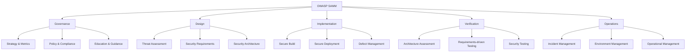

# 7.5 Secure SDLC: integrate security vào quy trình

> **Tóm tắt một dòng**: Security tốt không phải "kiểm tra cuối", mà là **integrate vào mọi phase của software development lifecycle**. Bài này dạy 3 framework công nghiệp chuẩn: Microsoft SDL (practice-based), OWASP SAMM (maturity model), và DevSecOps (shift-left). Bạn sẽ biết cách tổ chức team và CI/CD để security là first-class concern.

## Tại sao SDLC quan trọng?

Đã thấy trong Lec 1 ([bài 1.2](../01-introduction/02-cia-and-properties)) quy tắc Boehm: chi phí sửa bug tăng theo cấp số mũ qua các giai đoạn. Bug requirement = \$1, bug post-production = \$200+. Security bug tệ hơn vì:

- **Reputation cost**: breach lộ ra, mất khách hàng.
- **Legal/regulatory cost**: GDPR fine, lawsuit.
- **Incident response cost**: hire forensic, notify customer, lawyer.

Vì thế, đầu tư vào SDLC giúp catch bug sớm = cost-effective hơn rất nhiều.

Có 3 framework chính, mỗi cái với góc nhìn khác:

1. **Microsoft SDL**: practice-based (làm cái gì cụ thể).
2. **OWASP SAMM**: maturity-based (đo mức độ trưởng thành).
3. **DevSecOps**: cultural + tooling (shift left + automation).

Hiểu cả 3 giúp bạn áp dụng phù hợp scope.

## 1. Microsoft Security Development Lifecycle (SDL)

Microsoft công bố SDL năm 2004 sau hàng loạt security crisis của Windows. Là framework 12 practice cụ thể, đã được battle-tested trên codebase nhiều triệu dòng.

### 12 SDL Practices

| # | Practice | Phase |
|---|---|---|
| 1 | Establish security requirements | Requirement |
| 2 | Create quality gates and bug bars | Requirement |
| 3 | Perform security and privacy risk assessments | Requirement |
| 4 | Establish design requirements | Design |
| 5 | Perform attack surface analysis | Design |
| 6 | Use threat modeling | Design |
| 7 | Use approved tools | Implementation |
| 8 | Deprecate unsafe functions | Implementation |
| 9 | Perform static analysis | Implementation |
| 10 | Perform dynamic analysis | Verification |
| 11 | Perform fuzz testing | Verification |
| 12 | Conduct attack surface review | Verification |

Cộng thêm 4 practice cho **Release** và **Response** phase:
- 13. Create incident response plan
- 14. Conduct final security review
- 15. Certify release and archive
- 16. Execute incident response plan

### Triển khai SDL trong team

**Practice 1-3 (Requirement)**: trước khi code, viết security requirement formal. STAR format (đã thấy trong [bài 1.2](../01-introduction/02-cia-and-properties)). Cho mỗi feature, hỏi:
- Confidentiality, Integrity, Availability requirement nào?
- Có xử lý PII không? GDPR/CCPA apply.
- Có giao dịch tiền không? PCI-DSS apply.

**Practice 4-6 (Design)**: threat model. STRIDE cho mỗi component. Attack surface analysis: liệt kê mọi entry point (API endpoint, file upload, network port). Giảm surface nếu có thể (disable feature không dùng).

**Practice 7-9 (Implementation)**: 
- "Approved tools" = compiler version stable, không dùng feature deprecated.
- "Unsafe functions" = không `strcpy`, `gets`, `sprintf`.
- SAST trong CI = Coverity, SonarQube, Veracode.

**Practice 10-12 (Verification)**:
- Dynamic analysis = run app under sanitizer (ASan, MSan).
- Fuzz testing = AFL, libFuzzer (xem [bài 5.6](../04-dynamic-analysis/06-blackbox-grammar-mutation)).
- Attack surface review = pen test cuối.

**Practice 13-16 (Release & Response)**:
- IR plan = playbook khi breach.
- Final review = security sign-off trước launch.
- Archive = snapshot code + dependency để forensic sau này.
- Execute IR khi sự cố xảy ra.

### Where it works best

SDL phù hợp cho:
- Company có resource đầu tư security team riêng.
- Software lifecycle dài (3-5 năm), không thay đổi nhanh.
- High-stake software (OS, browser, kernel, infrastructure).

Less fit cho:
- Startup move fast, weekly release.
- App có pivot thường xuyên.

## 2. OWASP SAMM (Software Assurance Maturity Model)

OWASP SAMM khác SDL ở chỗ: thay vì list practice cụ thể, nó đánh giá **mức độ trưởng thành** của tổ chức.

### 5 Business Functions

SAMM chia security ra 5 mảng (business function):



15 practice (3 mỗi function), mỗi practice có 3 maturity level:

- **Level 0**: chưa có gì.
- **Level 1**: ad-hoc, làm theo project.
- **Level 2**: defined, có process formal.
- **Level 3**: optimized, measured và improved continuously.

### Cách dùng

**Step 1: Assessment**. Tự đánh giá hoặc thuê consultant đánh giá maturity hiện tại của từng practice (0-3). Output: scorecard 15 dòng.

**Step 2: Target**. Đặt target level cho mỗi practice dựa trên industry, regulation, risk. Startup: target 1-2 cho hầu hết. Bank: target 2-3.

**Step 3: Roadmap**. Lên kế hoạch fill gap. Mỗi practice nâng cấp 1 level mất ~3-12 tháng.

**Step 4: Re-assess**. Hàng năm, re-assess, đo improvement.

### Ưu điểm SAMM

- **Đo được tiến độ**: trước-sau định lượng.
- **Vendor-neutral**: không bound vào tool nào.
- **Industry-agnostic**: dùng được cho fintech, healthcare, gov.
- **Free**: documentation và tool công khai.

### Khi nào dùng

SAMM phù hợp cho:
- CISO mới gia nhập, cần baseline.
- Audit annual review.
- M&A due diligence.
- Compare với industry peer.

## 3. DevSecOps: Shift Left

DevSecOps là evolution của DevOps + Security. Triết lý: **"Shift Left"** = move security check từ cuối quy trình (trước release) lên đầu (trong dev).

### Truyền thống vs DevSecOps

**Truyền thống (waterfall + security gate cuối)**:

```
Dev → QA → Security review (block) → Release
                                ↑
                          Tốn 1-3 tháng,
                          block release,
                          nhiều rework
```

**DevSecOps**:

```
Dev (with linting, SAST) → CI (test + DAST + SCA) → Stage (pen test) → Prod
   ↑                          ↑                          ↑
Catch ngay khi commit    Catch khi push PR        Catch trước release
```

Mỗi tầng catch một class bug. Cost giảm vì bug catch sớm rẻ hơn.

### Tool stack DevSecOps điển hình

| Phase | Tool category | Examples |
|---|---|---|
| Code (local) | IDE plugin | SonarLint, ESLint security, Snyk IDE |
| Commit | Pre-commit hook | TruffleHog (secret scan), gitleaks |
| Build | SAST | SonarQube, Coverity, Snyk Code, GitHub CodeQL |
| Build | SCA (Software Composition Analysis) | Snyk, Dependabot, OWASP Dependency-Check |
| Build | Container scan | Trivy, Grype, Snyk Container |
| Build | IaC scan | Checkov, Tfsec, Snyk IaC |
| Test | DAST | OWASP ZAP, Burp Suite, Acunetix |
| Test | Fuzzing | AFL, libFuzzer, OSS-Fuzz |
| Pre-deploy | Image signing | Cosign, Notation |
| Deploy | Policy as code | OPA, Kyverno |
| Runtime | RASP, WAF | Cloudflare, AWS WAF, Imperva |
| Runtime | Monitoring | Datadog, Splunk, ELK + SIEM |

Không phải tất cả tool. Chọn 1 tool / category, integrate well.

### Ví dụ pipeline thực tế

`.github/workflows/security.yml`:

```yaml
name: Security checks
on: [push, pull_request]

jobs:
  sast:
    runs-on: ubuntu-latest
    steps:
      - uses: actions/checkout@v4
      - name: CodeQL Analysis
        uses: github/codeql-action/init@v3
        with: { languages: javascript, python }
      - uses: github/codeql-action/analyze@v3

  sca:
    runs-on: ubuntu-latest
    steps:
      - uses: actions/checkout@v4
      - name: Snyk dependency scan
        uses: snyk/actions/node@master
        env: { SNYK_TOKEN: ${{ secrets.SNYK_TOKEN }} }
        with: { args: --severity-threshold=high }

  secrets:
    runs-on: ubuntu-latest
    steps:
      - uses: actions/checkout@v4
      - name: TruffleHog scan
        uses: trufflesecurity/trufflehog@main
        with: { extra_args: --only-verified }

  container:
    runs-on: ubuntu-latest
    steps:
      - uses: actions/checkout@v4
      - name: Build image
        run: docker build -t app:${{ github.sha }} .
      - name: Trivy scan
        uses: aquasecurity/trivy-action@master
        with:
          image-ref: app:${{ github.sha }}
          severity: CRITICAL,HIGH
          exit-code: 1
```

Mỗi PR chạy 4 job song song. Block merge nếu bất kỳ critical finding.

### Security Champions

Một idea quan trọng từ DevSecOps: **Security Champion** trong mỗi team dev. Không phải fulltime security engineer, mà là developer có training thêm về security, là cầu nối với central security team.

Role:
- Review security của PR trong team.
- Tổ chức threat model cho feature mới.
- Triage finding từ scanner.
- Train teammate về best practice.

Scale tốt hơn so với 1 central security team review mọi PR (bottleneck).

## So sánh 3 framework

| Tiêu chí | Microsoft SDL | OWASP SAMM | DevSecOps |
|---|---|---|---|
| Tính chất | Prescriptive (practice cụ thể) | Descriptive (maturity model) | Cultural + tooling |
| Phù hợp | High-stake software | Mọi tổ chức cần assess | Cloud-native, fast-moving |
| Setup time | Tháng | Tuần (assessment) | Liên tục |
| Cost | Trung bình-cao | Thấp (self-assess) | Trung bình (tool license) |
| Auditable | Có | Rất tốt | Tuỳ tool |

Không exclusive. Tổ chức trưởng thành thường **kết hợp** cả 3:
- SDL cho practice list cụ thể.
- SAMM cho measure progress.
- DevSecOps cho automation + culture.

## Triển khai cho startup vs enterprise

### Startup (5-50 người)

**Tháng 1-3**:
- Setup pre-commit hook (gitleaks).
- SCA trong CI (Snyk free hoặc Dependabot).
- Auth provider (Auth0/Cognito).

**Tháng 3-12**:
- SAST (SonarCloud).
- Container scan (Trivy).
- Tăng coverage test.

**Year 2+**:
- Pen test annual.
- SAMM assessment level 1.
- SOC 2 readiness.

Cost: \$500-2000/month tool license.

### Enterprise (500+ người)

**Year 1**:
- Hire CISO + security team.
- SAMM baseline assessment.
- Choose SDL hoặc custom framework.
- Centralize tool: SAST, SCA, container, IaC.
- Security training cho mọi developer.

**Year 2-3**:
- Security Champion network.
- Bug bounty program.
- Threat modeling formal cho mọi feature.
- Compliance: SOC 2, ISO 27001.

**Year 4+**:
- SAMM level 2-3 trên hầu hết practice.
- Red team exercise quarterly.
- Industry-specific cert (PCI-DSS, HIPAA, FedRAMP).

Cost: \$1-10M/year depending size.

## Common pitfalls

### Pitfall 1: "Security is everyone's job" without ownership

Slogan đẹp, không actionable. Cần specific role: CISO, security team, security champion in each dev team.

### Pitfall 2: Too many tools

Mua 20 tool overlapping. Team không có time configure, ignore alert. Better: pick 1 best tool / category.

### Pitfall 3: Security as gate, not partner

Security team chỉ "say no". Developer find workaround. Better: security team co-design với dev, suggest alternative.

### Pitfall 4: Alert fatigue

SAST sinh 10000 finding, 99% false positive. Developer ignore = miss real bug.

Mitigation:
- Tune rule cho codebase.
- Suppress accepted risk explicitly.
- Triage process: critical < 1 day, high < 1 week.

### Pitfall 5: No metrics

"We do security" không đo được. Cần KPI:
- % code covered by SAST.
- Mean time to remediate critical CVE.
- % production endpoint with auth.
- % employee with phishing training.
- ...

### Pitfall 6: Bỏ qua people side

Phishing 80% bắt đầu sự cố. Tool không chống được. Cần training annual + simulation.

## Tóm tắt

- **Microsoft SDL**: 12 practice qua 6 phase, prescriptive.
- **OWASP SAMM**: 15 practice qua 5 business function, 0-3 maturity level.
- **DevSecOps**: shift left + automation + culture.
- 3 framework không exclusive, thường kết hợp.
- Startup vs Enterprise có roadmap khác.
- Tránh: ownership unclear, tool overlap, security as blocker, alert fatigue, no metric.

## Tham khảo

- [Microsoft SDL practices](https://www.microsoft.com/en-us/securityengineering/sdl/practices)
- [OWASP SAMM](https://owaspsamm.org/)
- [BSIMM (Building Security In Maturity Model)](https://www.bsimm.com/): tương tự SAMM nhưng commercial.
- [NIST SSDF (Secure Software Development Framework)](https://csrc.nist.gov/publications/detail/sp/800-218/final).

## DS perspective

Secure SDLC có nhiều điểm tương đồng với **MLOps**:

| Concept | Secure SDLC | MLOps |
|---|---|---|
| Versioning | Code + dependency lock | Model + data + code |
| Reproducibility | SBOM, locked deps | Data versioning, model registry |
| Continuous testing | SAST, DAST trong CI | Continuous training, validation |
| Monitoring | SIEM, alert | Model drift detection |
| Incident response | Breach playbook | Model rollback playbook |
| Maturity model | SAMM | ML Maturity Model (Google) |

Cả 2 đều shift-left, automate, treat artifact (binary / model) như first-class. Hiểu DevSecOps giúp bạn build MLOps tốt hơn và ngược lại.

## Mini-quiz

<details>
<summary>Q1. Phân biệt SDL và SAMM trong 1 câu mỗi cái.</summary>

**SDL**: prescriptive framework liệt kê 12-16 practice security cụ thể phải làm trong từng phase SDLC.

**SAMM**: descriptive maturity model đánh giá 15 practice qua 5 business function ở 4 mức (0-3) để team biết mình đang ở đâu và cần improve gì.

SDL trả lời "làm gì". SAMM trả lời "ở mức nào".
</details>

<details>
<summary>Q2. Cho công ty 20 dev đang chuyển từ "no security process" sang DevSecOps. Recommend roadmap 6 tháng.</summary>

**Tháng 1**: foundation tool.
- Pre-commit hook (gitleaks).
- Dependabot/Snyk free tier trong GitHub.
- Auth provider managed (Auth0 hoặc Cognito).
- Annual security training cho mọi dev (KnowBe4 hoặc tương đương).

**Tháng 2**: SAST + container scan.
- SonarCloud (free cho open source, \$10/month/dev cho private).
- Trivy scan container trong CI.
- Block PR merge nếu critical finding.

**Tháng 3**: secrets management.
- Setup AWS Secrets Manager hoặc Vault.
- Migrate hardcoded secret.
- Rotation policy.

**Tháng 4**: monitoring.
- CloudWatch alarm cho 5xx spike, login fail spike.
- SIEM hoặc log aggregator (Datadog, Splunk).
- On-call rotation.

**Tháng 5**: pen test + bug bounty.
- Hire 3rd party pen test (\$15-30K).
- Setup HackerOne private program.

**Tháng 6**: maturity check.
- OWASP SAMM self-assessment.
- Set target Level 1 cho most practice, Level 2 cho critical.
- Plan year 2.

Budget: \$500-2000/month tool + \$20-40K one-time pen test.
</details>

<details>
<summary>Q3. "Alert fatigue" là gì? Cho 3 cách mitigate.</summary>

**Alert fatigue**: SAST/DAST sinh quá nhiều alert (thường 99% false positive), developer overwhelmed, ignore mọi alert kể cả true positive.

**Mitigation**:

1. **Tune rule cho codebase**: disable rule không apply, adjust severity. Ví dụ "fix all SQL injection" rule không relevant cho ORM-only code. Disable rule này, focus rule khác.

2. **Suppress accepted risk explicitly**: với finding biết là false positive, mark in tool với reason. Khác với "ignore silently" - tool track exception, audit.

3. **Triage process với SLA**:
   - Critical: triage < 1 day, fix < 1 week.
   - High: triage < 1 week, fix < 1 month.
   - Medium: review hàng quý.
   - Low: bulk-suppress hoặc fix khi touch related code.

4. (Bonus) **Risk-based prioritization**: tool modern (Snyk, Mend) có "exploitable" filter, chỉ show finding actually reachable từ code path real. Giảm noise.

5. (Bonus) **Security Champion làm gatekeeper**: champion review batch alert weekly, escalate true positive lên team, suppress false. Developer chỉ thấy alert đã filtered.
</details>

---

**Kết thúc Cụm 7 (Topics Bổ sung).** Bạn đã có toàn bộ kiến thức: lý thuyết (Lec 1-5) + tư vấn (Lec 6) + công cụ + framework + process (Lec 7). Quay về [trang chính](/docs/intro) hoặc tra cứu [Glossary](../resources/glossary).
